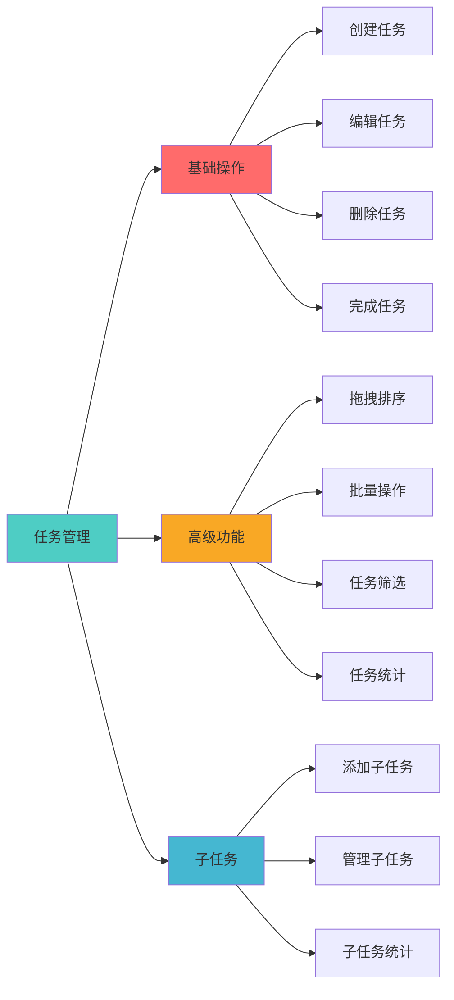
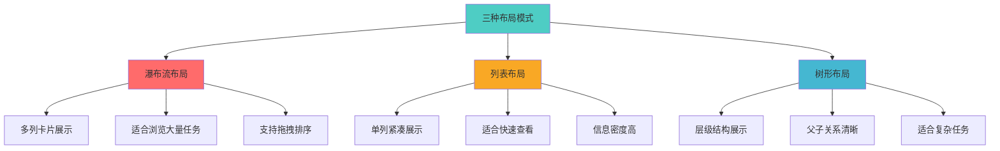
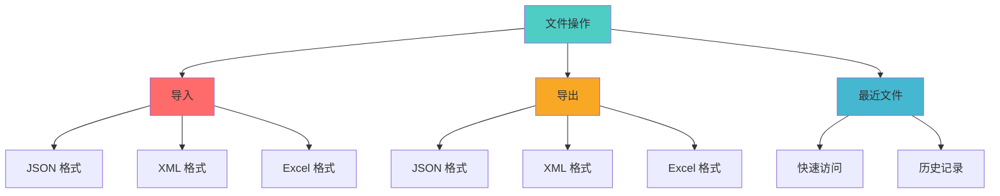
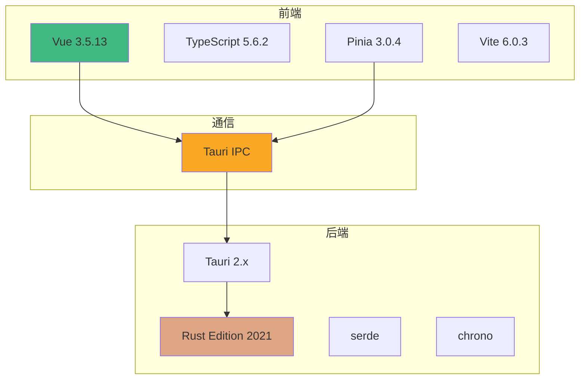
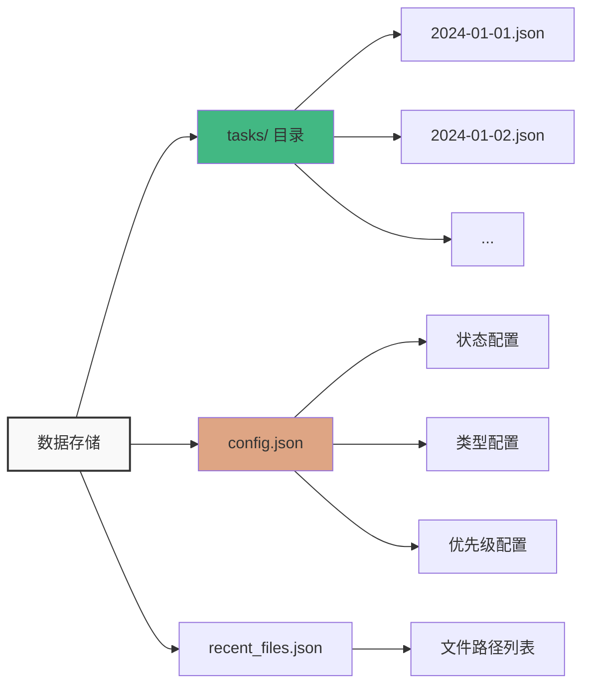
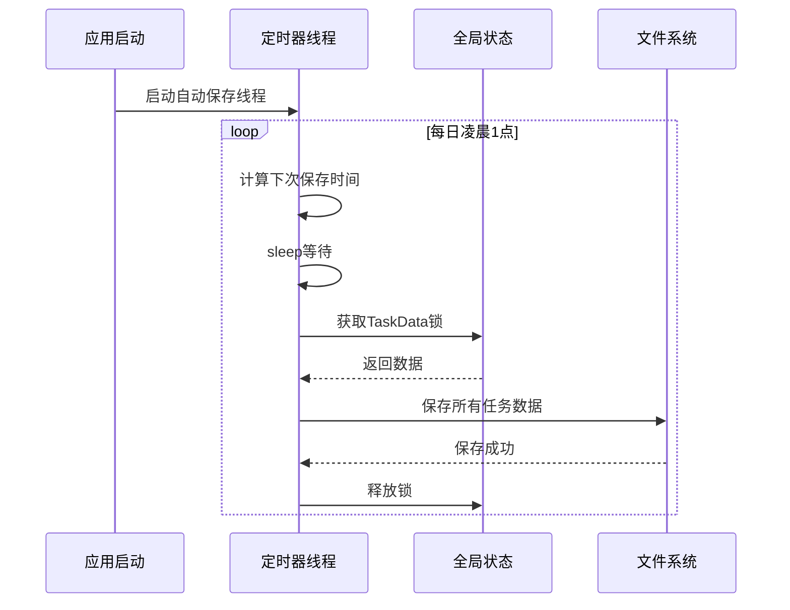

# 灵境待办 (LingJingToDo)

<div align="center">

一个基于 **Tauri 2 + Vue 3 + TypeScript + Rust** 构建的现代化跨平台桌面任务管理应用

[](LICENSE)
[](https://tauri.app/)
[](https://vuejs.org/)
[](https://www.rust-lang.org/)

[功能特性](#功能特性) • [快速开始](#快速开始) • [技术架构](#技术架构) • [文档](#文档) • [项目状态](#项目状态)

</div>

---

## 项目简介

**灵境待办** 是一款功能强大、界面美观的跨平台桌面任务管理应用。采用现代化的技术栈构建，提供流畅的用户体验和丰富的功能特性。

### 核心亮点

- 🚀 **高性能**: Rust 后端 + Vue 3 前端，性能优异
- 📦 **跨平台**: 支持 Windows、macOS、Linux
- 💾 **多格式支持**: JSON、XML、Excel 导入导出
- 🔄 **自动保存**: 定时自动保存，数据安全可靠
- 🎯 **灵活布局**: 瀑布流、列表、树形三种视图
- 🎨 **主题系统**: 支持亮色/暗色主题切换
- 📊 **任务统计**: 完善的任务统计和分析功能
- 🔍 **高级搜索**: 支持多条件组合查询

---

## 项目状态

### 当前版本信息

- **版本号**: v1.0.0
- **发布状态**: 稳定版
- **最后更新**: 2026-05-17
- **开发状态**: 活跃开发中

### 项目统计

| 指标 | 数量 |
|------|------|
| Vue 组件 | 27 个 |
| Rust 源文件 | 7 个 |
| Tauri API 命令 | 28 个 |
| 文档文件 | 19 个 |
| 代码行数 | ~15,000+ |

### 最近更新

- ✅ 引入 Pinia 状态管理库，提升性能
- ✅ 实现虚拟滚动，优化大数据渲染
- ✅ 添加全局错误边界处理
- ✅ 支持全局快捷键操作
- ✅ 完善文件导入导出功能
- ✅ 优化主题和任务控制

### 已知问题

目前项目运行稳定，暂无重大问题。部分优化建议请参考 [优化建议](#优化建议) 章节。

---

## 功能特性

### 任务管理



### 多视图布局



### 配置系统

- **状态管理**: 待规划、已启动、进行中、已完成、已延期、已关闭
- **类型管理**: 工作、学习、生活（可自定义）
- **优先级管理**: P0-致命 ~ 不紧急（7个级别）
- **主题系统**: 亮色/暗色主题，支持自定义

### 文件操作



---

## 快速开始

### 环境要求

- **Node.js**: >= 18.0.0
- **Rust**: Edition 2021
- **pnpm/npm/yarn**: 任意包管理器

### 安装步骤

```bash
# 1. 克隆项目
git clone https://github.com/hemy08/LingJingToDo.git
cd LingJingToDo

# 2. 安装依赖
npm install

# 3. 开发模式运行
npm run tauri:dev

# 4. 生产构建
npm run tauri:build
```

### 开发命令

| 命令 | 说明 |
|------|------|
| `npm run dev` | 启动前端开发服务器 |
| `npm run build` | 构建前端生产版本 |
| `npm run tauri:dev` | 启动 Tauri 开发模式 |
| `npm run tauri:build` | 构建 Tauri 生产应用 |

---

## 技术架构

### 技术栈



### 项目结构

```
LingJingToDo/
├── lingjing_uiux/          # Vue 前端代码
│   ├── components/         # Vue 组件
│   ├── stores/             # Pinia 状态管理
│   ├── composables/        # 组合式函数
│   └── assets/             # 样式资源
├── lingjing_server/        # Rust 后端代码
│   ├── src/                # Rust 源码
│   ├── data/               # 数据存储
│   └── tauri.conf.json     # Tauri 配置
├── docs/                   # 项目文档
├── public/                 # 静态资源
└── package.json            # 项目配置
```

### 核心模块

#### 前端模块

| 模块 | 说明 |
|------|------|
| `components/` | Vue 组件（27个） |
| `stores/` | Pinia 状态管理（4个） |
| `composables/` | 组合式函数（2个） |
| `connections/` | API 连接层 |

#### 后端模块

| 模块 | 说明 |
|------|------|
| `tasks.rs` | 任务管理核心逻辑 |
| `config.rs` | 配置管理 |
| `file_ops.rs` | 文件操作 |
| `error.rs` | 错误处理 |

---

## API 接口

### 任务 API（14个）

| 命令 | 说明 |
|------|------|
| `get_tasks` | 获取指定日期的任务 |
| `add_task` | 添加任务 |
| `update_task` | 更新任务 |
| `delete_task` | 删除任务 |
| `reorder_tasks` | 重排序任务 |
| `get_all_tasks` | 获取所有任务 |
| `import_tasks` | 导入任务 |
| `generate_main_task_id` | 生成主任务ID |
| `generate_subtask_id` | 生成子任务ID |
| `add_subtask` | 添加子任务 |
| `update_subtask` | 更新子任务 |
| `delete_subtask` | 删除子任务 |
| `query_tasks` | 查询任务 |
| `get_task_statistics` | 获取任务统计 |

### 配置 API（10个）

| 命令 | 说明 |
|------|------|
| `get_all_statuses` | 获取所有状态 |
| `update_statuses` | 更新状态配置 |
| `delete_status` | 删除状态 |
| `get_all_types` | 获取所有类型 |
| `update_types` | 更新类型配置 |
| `delete_type` | 删除类型 |
| `get_all_priorities` | 获取所有优先级 |
| `update_priorities` | 更新优先级配置 |
| `delete_priority` | 删除优先级 |

### 文件 API（4个）

| 命令 | 说明 |
|------|------|
| `open_file` | 打开文件（JSON/XML/Excel） |
| `save_file` | 保存文件 |
| `get_recent_files` | 获取最近文件列表 |
| `add_recent_file` | 添加到最近文件 |

---

## 数据存储

### 存储结构



### 自动保存机制



---

## 文档

完整文档位于 `docs/` 目录：

- 📚 [项目架构文档](./docs/architecture.md) - 系统架构、技术栈、组件设计
- 👨‍💻 [开发者指南](./docs/developer-guide.md) - 开发流程、调试技巧、贡献指南
- 🔌 [API 参考文档](./docs/api-reference.md) - 完整的 API 接口说明
- 📖 [用户手册](./docs/user-manual.md) - 安装、使用、配置指南
- 📊 [项目分析报告](./docs/项目分析报告.md) - 详细的项目分析
- 🚀 [优化建议](./docs/optimization-and-extension.md) - 优化和扩展建议

---

## 优化建议

### 性能优化

#### 1. 状态管理优化
- ✅ 已引入 Pinia 状态管理
- 🔄 建议：使用 `shallowRef` 减少深层响应式开销
- 🔄 建议：实现状态持久化插件

#### 2. 渲染性能优化
- ✅ 已实现虚拟滚动
- 🔄 建议：使用 `v-memo` 优化列表渲染
- 🔄 建议：实现组件懒加载

#### 3. 数据加载优化
- ✅ 已实现数据缓存
- 🔄 建议：添加请求去重机制
- 🔄 建议：实现增量更新

### 代码质量优化

#### 1. 测试覆盖
- ⚠️ 缺少单元测试
- 🔄 建议：使用 Vitest 添加单元测试
- 🔄 建议：目标覆盖率 80%+

#### 2. 错误处理
- ✅ 已实现全局错误边界
- 🔄 建议：添加错误日志上报
- 🔄 建议：实现错误恢复机制

#### 3. 类型安全
- ✅ TypeScript 类型完整
- 🔄 建议：添加更严格的类型检查
- 🔄 建议：使用类型守卫

### 用户体验优化

#### 1. 交互优化
- ✅ 已支持拖拽排序
- 🔄 建议：添加更多快捷键
- 🔄 建议：实现撤销/重做功能

#### 2. 视觉优化
- ✅ 已支持主题切换
- 🔄 建议：添加更多主题选项
- 🔄 建议：实现主题自定义

#### 3. 功能增强
- 🔄 建议：添加任务标签系统
- 🔄 建议：实现任务模板功能
- 🔄 建议：添加时间追踪功能

### 架构优化

#### 1. 代码组织
- ✅ 组件化良好
- 🔄 建议：进一步拆分大组件
- 🔄 建议：统一组件命名规范

#### 2. 依赖管理
- ✅ 依赖版本合理
- 🔄 建议：定期更新依赖
- 🔄 建议：移除未使用依赖

---

## 已知问题

### 当前问题

1. **数据目录未纳入版本控制**
   - 问题：`lingjing_server/data/` 目录未提交到 Git
   - 影响：新用户克隆项目后需要手动创建数据
   - 解决：添加示例数据文件到仓库

2. **IDE 配置文件变更**
   - 问题：`.idea/LingJingToDo.iml` 有未提交的修改
   - 影响：可能影响其他开发者的 IDE 配置
   - 解决：统一 IDE 配置或添加到 .gitignore

3. **缺少单元测试**
   - 问题：项目缺少测试代码
   - 影响：难以保证代码质量和重构安全性
   - 解决：添加 Vitest 测试框架，编写单元测试

### 潜在风险

1. **数据安全**
   - 风险：本地文件存储可能丢失
   - 建议：实现数据备份功能
   - 建议：添加云同步选项

2. **性能瓶颈**
   - 风险：大量任务时可能卡顿
   - 建议：优化虚拟滚动实现
   - 建议：实现数据分页加载

3. **兼容性**
   - 风险：不同平台可能有差异
   - 建议：增加平台测试
   - 建议：处理平台特定问题

---

## 开发路线图

### 第一阶段（已完成）：基础功能
- ✅ 任务增删改查
- ✅ 子任务管理
- ✅ 文件导入导出
- ✅ 主题切换
- ✅ 拖拽排序

### 第二阶段（进行中）：性能优化
- ✅ Pinia 状态管理
- ✅ 虚拟滚动
- ✅ 错误边界
- 🔄 单元测试覆盖
- 🔄 性能监控

### 第三阶段（计划中）：高级功能
- ⏳ 时间追踪
- ⏳ 重复任务
- ⏳ 项目/分组管理
- ⏳ 数据可视化
- ⏳ 通知提醒

### 第四阶段（未来）：生态扩展
- ⏳ 多语言支持
- ⏳ 主题市场
- ⏳ 日历集成
- ⏳ 移动端支持
- ⏳ 协作功能

---

## 贡献指南

我们欢迎所有形式的贡献！

### 如何贡献

1. Fork 本仓库
2. 创建特性分支 (`git checkout -b feature/AmazingFeature`)
3. 提交更改 (`git commit -m 'Add some AmazingFeature'`)
4. 推送到分支 (`git push origin feature/AmazingFeature`)
5. 提交 Pull Request

### 开发规范

- 遵循 TypeScript 代码规范
- 遵循 Rust 代码规范
- 编写清晰的提交信息
- 添加必要的测试用例
- 更新相关文档

---

## 许可证

本项目采用 MIT 许可证 - 详见 [LICENSE](LICENSE) 文件

---

## 致谢

感谢以下开源项目：

- [Tauri](https://tauri.app/) - 跨平台桌面应用框架
- [Vue.js](https://vuejs.org/) - 渐进式 JavaScript 框架
- [Pinia](https://pinia.vuejs.org/) - Vue 状态管理
- [Rust](https://www.rust-lang.org/) - 系统编程语言

---

## 联系方式

- **项目地址**: [https://github.com/hemy08/LingJingToDo](https://github.com/hemy08/LingJingToDo)
- **问题反馈**: [Issues](https://github.com/hemy08/LingJingToDo/issues)
- **功能建议**: [Discussions](https://github.com/hemy08/LingJingToDo/discussions)

---

<div align="center">

**如果这个项目对您有帮助，请给一个 ⭐ Star 支持一下！**

Made with ❤️ by Hemy08

</div>
