# 灵境待办 (LingJingToDo)

<div align="center">

一个基于 **Tauri 2 + Vue 3 + TypeScript + Rust** 构建的现代化跨平台桌面任务管理应用

[](LICENSE)
[](https://tauri.app/)
[](https://vuejs.org/)
[](https://www.rust-lang.org/)

[功能特性](#功能特性) • [快速开始](#快速开始) • [技术架构](#技术架构) • [文档](#文档)

</div>

---

## 项目简介

**灵境待办** 是一款功能强大、界面美观的跨平台桌面任务管理应用。它采用现代化的技术栈构建，提供流畅的用户体验和丰富的功能特性。

### 核心亮点

- 🚀 **高性能**: Rust 后端提供卓越性能
- 🎨 **现代化UI**: Vue 3 + Composition API 构建流畅界面
- 📦 **跨平台**: 支持 Windows、macOS、Linux
- 💾 **多格式支持**: JSON、XML、Excel 导入导出
- 🔄 **自动保存**: 定时自动保存，数据安全可靠
- 🎯 **灵活布局**: 瀑布流、列表、树形三种视图

---

## 功能特性

### 任务管理

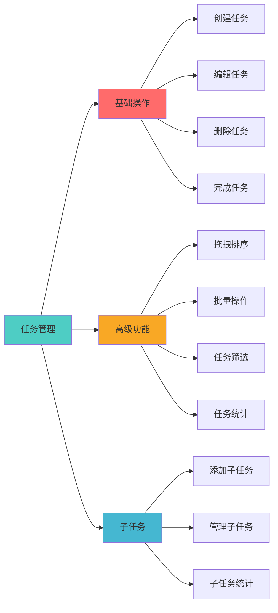

### 多视图布局

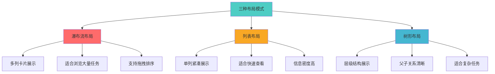

### 配置系统

- **状态管理**: 待规划、已启动、进行中、已完成、已延期、已关闭
- **类型管理**: 工作、学习、生活（可自定义）
- **优先级管理**: P0-致命 ~ 不紧急（7个级别）
- **主题系统**: 亮色/暗色主题，支持自定义

### 文件操作

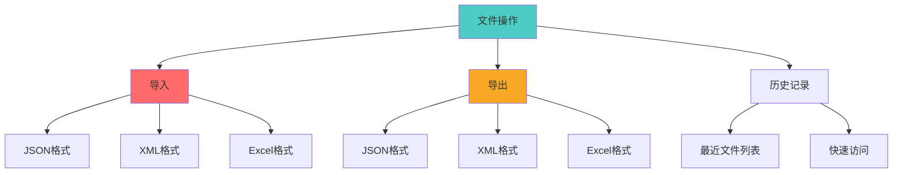

---

## 技术架构

### 整体架构

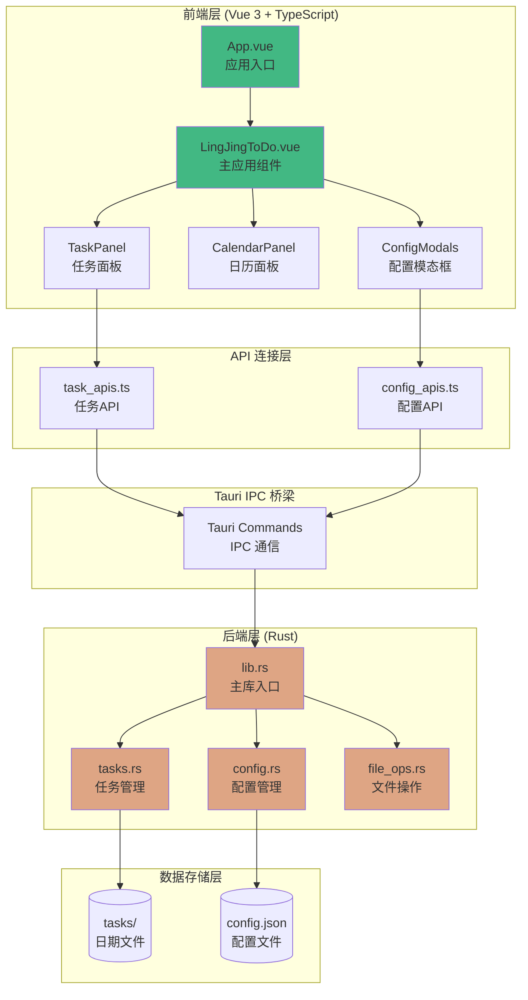

### 技术栈

```mermaid
graph LR
    subgraph "前端技术栈"
        A1[Vue 3.5.13<br/>Composition API]
        A2[TypeScript 5.6.2]
        A3[Vite 6.0.3]
        A4[SortableJS 1.15.7]
    end
    
    subgraph "桌面框架"
        B1[Tauri 2.x]
        B2[WebView]
        B3[Rust Runtime]
    end
    
    subgraph "后端技术栈"
        C1[Rust Edition 2021]
        C2[serde + serde_json]
        C3[chrono 0.4.44]
        C4[rust_xlsxwriter]
        C5[calamine]
    end
    
    A1 --> B2
    A3 --> B1
    B1 --> B3
    B3 --> C1
    
    C1 --> C2
    C1 --> C3
    C1 --> C4
    C1 --> C5
    
    style A1 fill:#42b883
    style B1 fill:#24292e
    style C1 fill:#dea584
```

### 前端组件架构

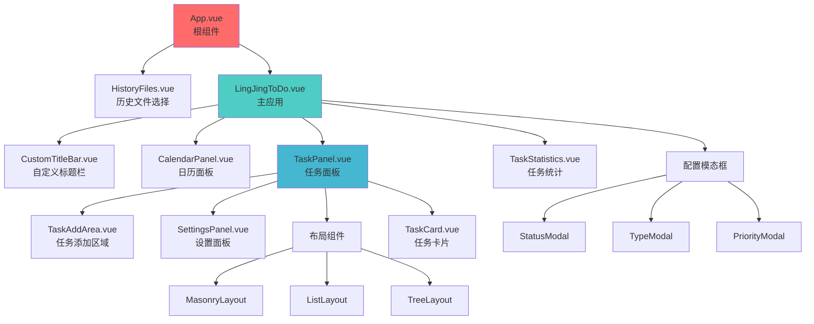

### 后端模块架构

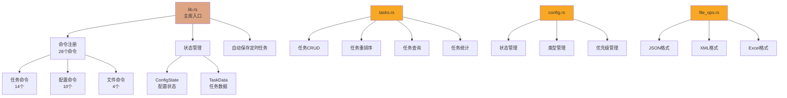

### 数据模型

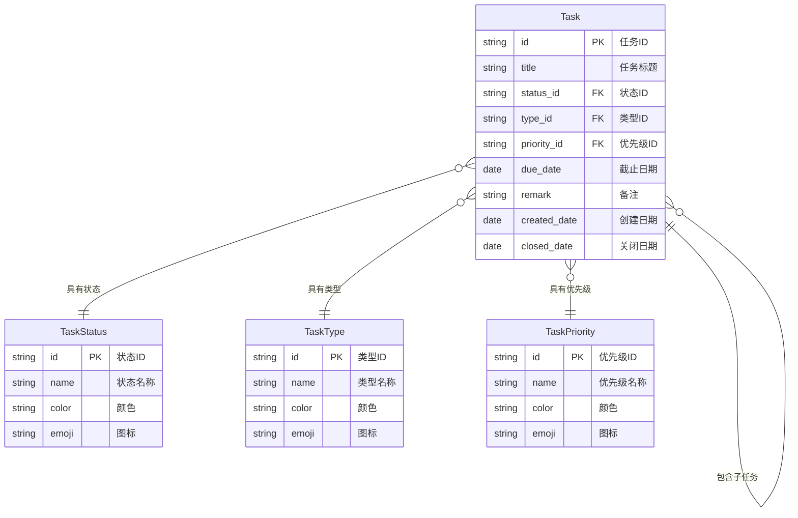

### API 调用流程

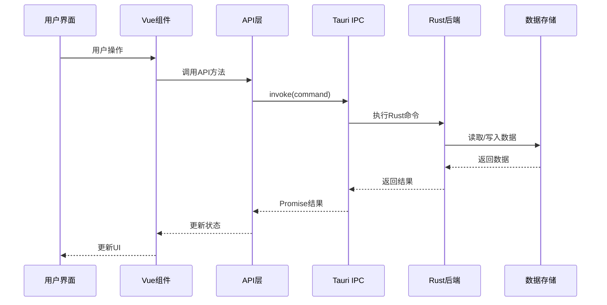

---

## 快速开始

### 环境要求

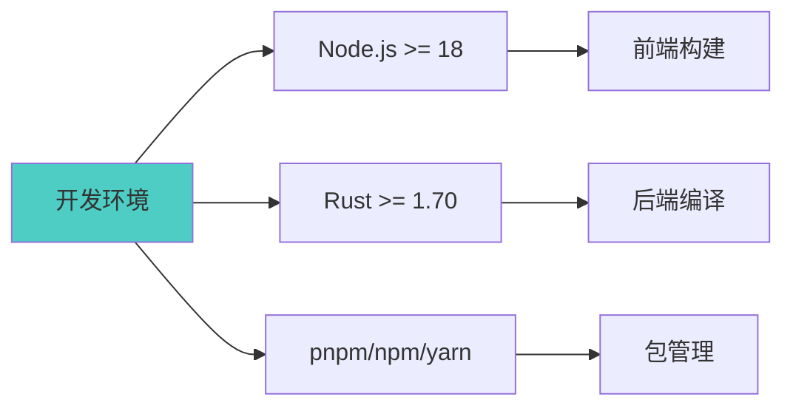

### 安装步骤

1. **克隆项目**
```bash
git clone https://github.com/hemy08/LingJingToDo.git
cd LingJingToDo
```

2. **安装依赖**
```bash
# 使用 pnpm（推荐）
pnpm install

# 或使用 npm
npm install

# 或使用 yarn
yarn install
```

3. **开发模式运行**
```bash
pnpm tauri dev
```

4. **生产构建**
```bash
pnpm tauri build
```

构建完成后，安装包位于 `lingjing_server/src-tauri/target/release/bundle/` 目录。

---

## 项目结构

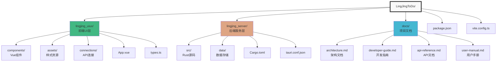

---

## API 概览

项目提供了 **28 个 Tauri 命令**，分为三大模块：

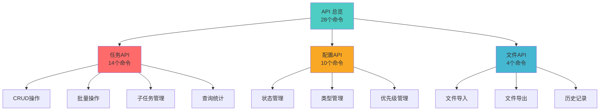

### 任务 API（14个）

| 命令 | 说明 |
|------|------|
| `get_tasks` | 获取指定日期的任务列表 |
| `add_task` | 添加新任务 |
| `update_task` | 更新任务 |
| `delete_task` | 删除任务 |
| `reorder_tasks` | 重排序任务 |
| `get_all_tasks` | 获取所有任务 |
| `import_tasks` | 批量导入任务 |
| `generate_main_task_id` | 生成主任务ID |
| `generate_subtask_id` | 生成子任务ID |
| `add_subtask` | 添加子任务 |
| `update_subtask` | 更新子任务 |
| `delete_subtask` | 删除子任务 |
| `query_tasks` | 查询任务 |
| `get_task_statistics` | 获取任务统计 |

### 配置 API（10个）

| 命令 | 说明 |
|------|------|
| `get_all_statuses` | 获取所有状态 |
| `update_statuses` | 更新状态配置 |
| `delete_status` | 删除状态 |
| `get_all_types` | 获取所有类型 |
| `update_types` | 更新类型配置 |
| `delete_type` | 删除类型 |
| `get_all_priorities` | 获取所有优先级 |
| `update_priorities` | 更新优先级配置 |
| `delete_priority` | 删除优先级 |

### 文件 API（4个）

| 命令 | 说明 |
|------|------|
| `open_file` | 打开文件（JSON/XML/Excel） |
| `save_file` | 保存文件 |
| `get_recent_files` | 获取最近文件列表 |
| `add_recent_file` | 添加到最近文件 |

---

## 数据存储

### 存储结构

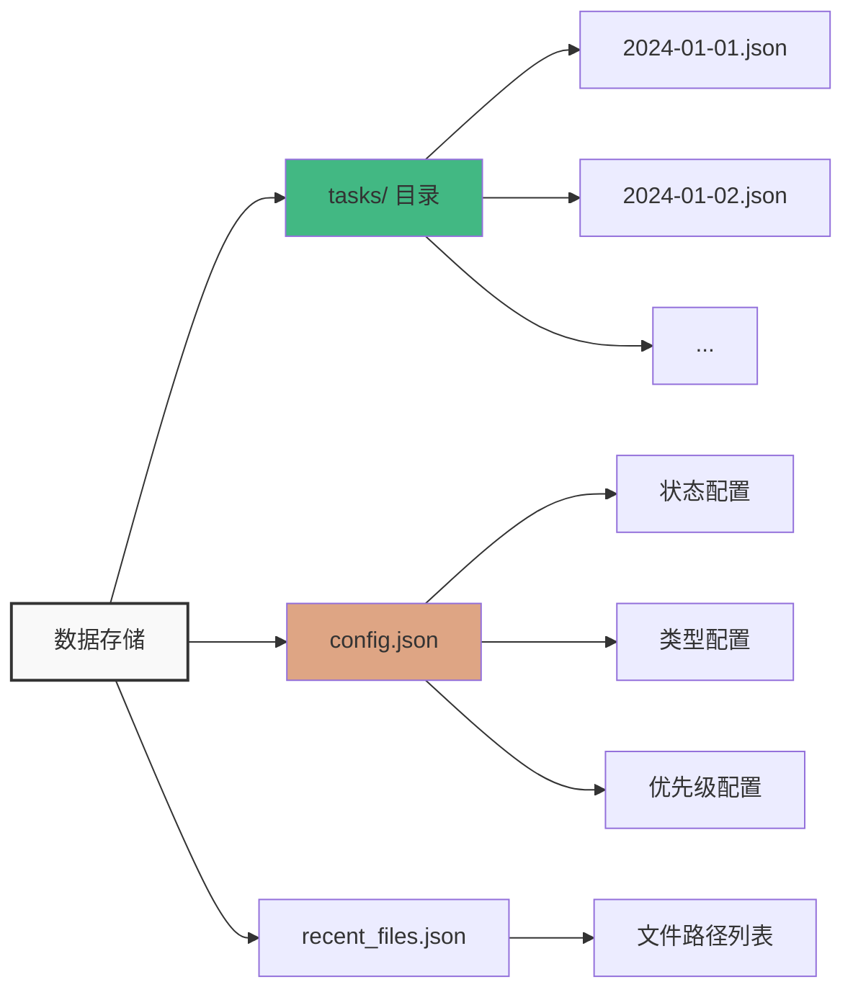

### 自动保存机制

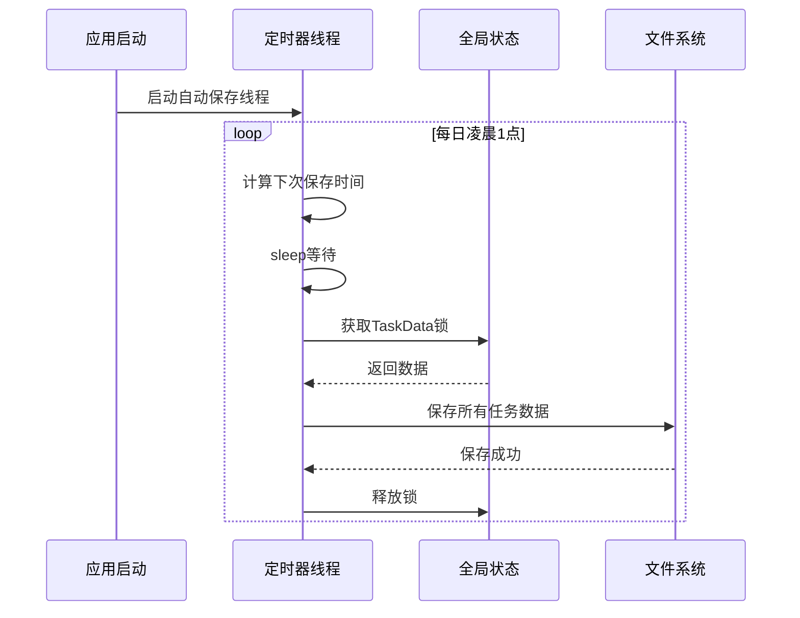

---

## 文档

完整文档位于 `docs/` 目录：

- 📚 [项目架构文档](./docs/architecture.md) - 系统架构、技术栈、组件设计
- 👨‍💻 [开发者指南](./docs/developer-guide.md) - 开发流程、调试技巧、贡献指南
- 🔌 [API 参考文档](./docs/api-reference.md) - 完整的 API 接口说明
- 📖 [用户手册](./docs/user-manual.md) - 安装、使用、配置指南

---

## 开发路线图

### 功能扩展规划

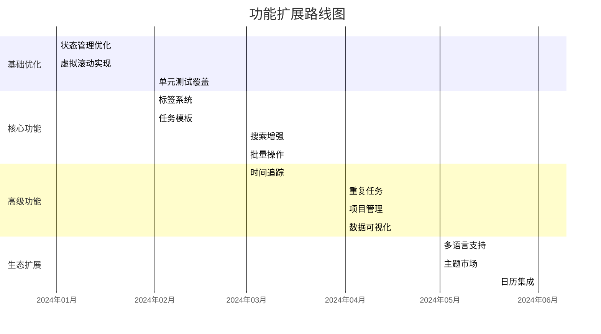

### 性能优化方向

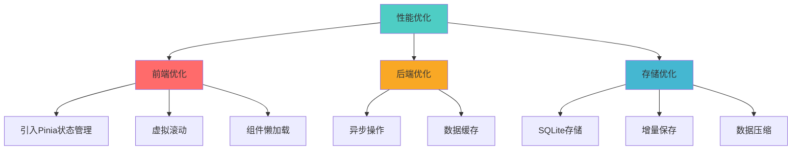

---

## 贡献指南

我们欢迎所有形式的贡献！

### 贡献流程


### 开发规范

- **代码风格**: 遵循 Vue 官方风格指南和 Rust 编码规范
- **提交信息**: 使用约定式提交格式
- **测试覆盖**: 新功能需添加测试
- **文档更新**: 重要功能需更新文档

---

## 常见问题

### Q: 如何在不同平台安装？

**A**: 
- **Windows**: 下载 `.msi` 安装包
- **macOS**: 下载 `.dmg` 安装包
- **Linux**: 下载 `.deb` 或 `.AppImage` 安装包

### Q: 数据存储在哪里？

**A**: 
- **Windows**: `C:\Users\用户名\AppData\Local\lingjingtodo\`
- **macOS**: `~/Library/Application Support/lingjingtodo/`
- **Linux**: `~/.local/share/lingjingtodo/`

### Q: 如何备份数据？

**A**: 使用导出功能，支持 JSON、XML、Excel 三种格式

---

## 许可证

本项目采用 [MIT](LICENSE) 许可证。

---

## 致谢

感谢以下开源项目：

- [Tauri](https://tauri.app/) - 跨平台桌面应用框架
- [Vue.js](https://vuejs.org/) - 渐进式 JavaScript 框架
- [Rust](https://www.rust-lang.org/) - 系统编程语言
- [SortableJS](https://sortablejs.github.io/Sortable/) - 拖拽库

---

## 联系方式

- **作者**: Hemy08
- **GitHub**: https://github.com/hemy08/LingJingToDo
- **问题反馈**: [GitHub Issues](https://github.com/hemy08/LingJingToDo/issues)

---

<div align="center">

**如果这个项目对你有帮助，请给一个 ⭐ Star 支持一下！**

Made with ❤️ by Hemy08

</div>
