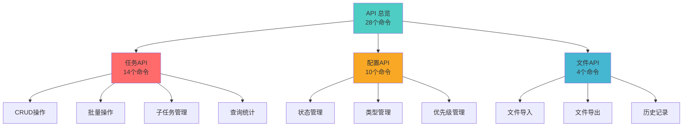
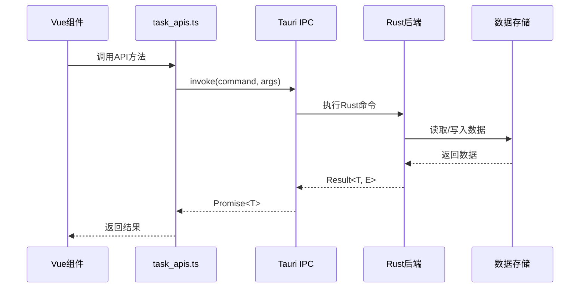
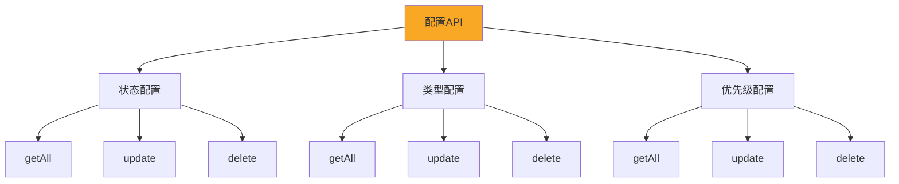
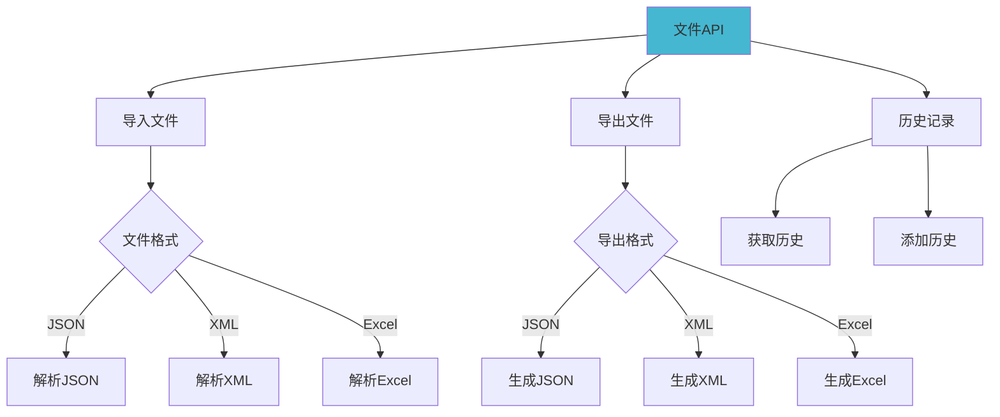
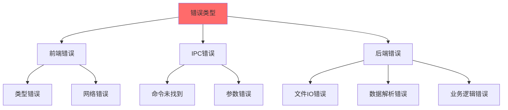
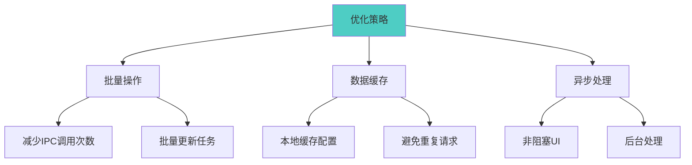

# 灵境待办 - API 参考文档

## API 概述

本项目通过 Tauri IPC 机制实现前后端通信，提供 **28 个 Tauri 命令**，分为三大模块：



---

## 任务 API

### API 调用流程



### 1. 获取任务列表

**命令**: `get_tasks`

**描述**: 获取指定日期的任务列表

**参数**:
- `date` (string): 日期，格式 `YYYY-MM-DD`

**返回**: `Promise<Task[]>`

**示例**:
```typescript
import { taskApi } from './connections/task_apis'

const tasks = await taskApi.getTasks('2024-01-15')
console.log(tasks) // [{id: '1', title: 'Task 1', ...}, ...]
```

**Rust 实现**:
```rust
#[tauri::command]
pub fn get_tasks(date: String, state: State<Mutex<TaskData>>) -> Vec<Task> {
    let task_data = state.lock().unwrap();
    task_data.tasks.get(&date).cloned().unwrap_or_default()
}
```

---

### 2. 添加任务

**命令**: `add_task`

**描述**: 添加新任务到指定日期

**参数**:
- `date` (string): 日期
- `task` (Task): 任务对象

**返回**: `Promise<Task>`

**示例**:
```typescript
const newTask = {
  id: await taskApi.generateMainTaskId(),
  title: 'New Task',
  status_id: 'pending',
  type_id: 'work',
  priority_id: 'p2',
  created_date: new Date().toISOString()
}

const result = await taskApi.addTask('2024-01-15', newTask)
```

---

### 3. 更新任务

**命令**: `update_task`

**描述**: 更新指定任务

**参数**:
- `date` (string): 日期
- `task` (Task): 更新后的任务对象

**返回**: `Promise<Task[] | null>`

**示例**:
```typescript
const updatedTask = { ...task, title: 'Updated Title' }
const tasks = await taskApi.updateTask('2024-01-15', updatedTask)
```

---

### 4. 删除任务

**命令**: `delete_task`

**描述**: 删除指定任务

**参数**:
- `date` (string): 日期
- `task_id` (string): 任务ID

**返回**: `Promise<Task[] | null>`

**示例**:
```typescript
const tasks = await taskApi.deleteTask('2024-01-15', 'task-123')
```

---

### 5. 重排序任务

**命令**: `reorder_tasks`

**描述**: 重新排序任务列表

**参数**:
- `date` (string): 日期
- `reordered_tasks` (Task[]): 重排序后的任务数组

**返回**: `Promise<Task[] | null>`

**示例**:
```typescript
// 拖拽排序后
const reorderedTasks = [tasks[1], tasks[0], tasks[2]]
await taskApi.reorderTasks('2024-01-15', reorderedTasks)
```

---

### 6. 获取所有任务

**命令**: `get_all_tasks`

**描述**: 获取所有日期的任务数据

**参数**: 无

**返回**: `Promise<Record<string, Task[]>>`

**示例**:
```typescript
const allTasks = await taskApi.getAllTasks()
// {
//   '2024-01-15': [task1, task2],
//   '2024-01-16': [task3, task4]
// }
```

---

### 7. 导入任务

**命令**: `import_tasks`

**描述**: 批量导入任务数据

**参数**:
- `tasks_data` (Record<string, Task[]>): 任务数据对象

**返回**: `Promise<void>`

**示例**:
```typescript
const importedData = {
  '2024-01-15': [task1, task2],
  '2024-01-16': [task3]
}
await taskApi.importTasks(importedData)
```

---

### 8. 生成主任务ID

**命令**: `generate_main_task_id`

**描述**: 生成唯一的主任务ID

**参数**: 无

**返回**: `Promise<string>`

**示例**:
```typescript
const taskId = await taskApi.generateMainTaskId()
// 'task-1705312800000-abc123'
```

---

### 9. 生成子任务ID

**命令**: `generate_subtask_id`

**描述**: 生成唯一的子任务ID

**参数**: 无

**返回**: `Promise<string>`

**示例**:
```typescript
const subtaskId = await taskApi.generateSubtaskId()
// 'subtask-1705312800000-xyz789'
```

---

### 10. 添加子任务

**命令**: `add_subtask`

**描述**: 为指定任务添加子任务

**参数**:
- `date` (string): 日期
- `parent_id` (string): 父任务ID
- `subtask` (Task): 子任务对象

**返回**: `Promise<Task[] | null>`

**示例**:
```typescript
const subtask = {
  id: await taskApi.generateSubtaskId(),
  title: 'Subtask 1',
  status_id: 'pending',
  type_id: 'work',
  priority_id: 'p2'
}

const tasks = await taskApi.addSubtask('2024-01-15', 'parent-123', subtask)
```

---

### 11. 更新子任务

**命令**: `update_subtask`

**描述**: 更新指定子任务

**参数**:
- `date` (string): 日期
- `parent_id` (string): 父任务ID
- `subtask` (Task): 更新后的子任务对象

**返回**: `Promise<Task[] | null>`

---

### 12. 删除子任务

**命令**: `delete_subtask`

**描述**: 删除指定子任务

**参数**:
- `date` (string): 日期
- `parent_id` (string): 父任务ID
- `subtask_id` (string): 子任务ID

**返回**: `Promise<Task[] | null>`

---

### 13. 查询任务

**命令**: `query_tasks`

**描述**: 按条件查询任务

**参数**:
- `date` (string): 日期
- `type_id` (string, optional): 类型ID
- `status_id` (string, optional): 状态ID
- `priority_id` (string, optional): 优先级ID

**返回**: `Promise<Task[]>`

**示例**:
```typescript
// 查询高优先级的待处理任务
const tasks = await taskApi.queryTasks(
  '2024-01-15',
  undefined,
  'pending',
  'p1'
)
```

---

### 14. 获取任务统计

**命令**: `get_task_statistics`

**描述**: 获取任务统计信息

**参数**: 无

**返回**: `Promise<TaskStatistics>`

**示例**:
```typescript
const stats = await taskApi.getTaskStatistics()
// {
//   total: 100,
//   completed: 45,
//   pending: 30,
//   overdue: 5,
//   by_type: { work: 50, study: 30, life: 20 },
//   by_priority: { p1: 10, p2: 20, ... }
// }
```

---

## 配置 API

### 配置管理流程



### 状态配置 API

#### 1. 获取所有状态

**命令**: `get_all_statuses`

**返回**: `Promise<TaskStatus[]>`

**示例**:
```typescript
import { statusApi } from './connections/config_apis'

const statuses = await statusApi.getAll()
// [
//   {id: 'pending', name: '待规划', color: '#gray', emoji: '📋'},
//   {id: 'in_progress', name: '进行中', color: '#blue', emoji: '🔄'},
//   ...
// ]
```

#### 2. 更新状态配置

**命令**: `update_statuses`

**参数**:
- `statuses` (TaskStatus[]): 状态配置数组

**返回**: `Promise<TaskStatus[]>`

**示例**:
```typescript
const updatedStatuses = [
  {id: 'pending', name: '待办', color: '#gray', emoji: '📝'},
  ...statuses.slice(1)
]
await statusApi.update(updatedStatuses)
```

#### 3. 删除状态

**命令**: `delete_status`

**参数**:
- `id` (string): 状态ID

**返回**: `Promise<TaskStatus[]>`

---

### 类型配置 API

#### 1. 获取所有类型

**命令**: `get_all_types`

**返回**: `Promise<TaskType[]>`

**示例**:
```typescript
import { typeApi } from './connections/config_apis'

const types = await typeApi.getAll()
// [
//   {id: 'work', name: '工作', color: '#blue', emoji: '💼'},
//   {id: 'study', name: '学习', color: '#green', emoji: '📚'},
//   {id: 'life', name: '生活', color: '#orange', emoji: '🏠'}
// ]
```

#### 2. 更新类型配置

**命令**: `update_types`

**参数**:
- `types` (TaskType[]): 类型配置数组

**返回**: `Promise<TaskType[]>`

#### 3. 删除类型

**命令**: `delete_type`

**参数**:
- `id` (string): 类型ID

**返回**: `Promise<TaskType[]>`

---

### 优先级配置 API

#### 1. 获取所有优先级

**命令**: `get_all_priorities`

**返回**: `Promise<TaskPriority[]>`

**示例**:
```typescript
import { priorityApi } from './connections/config_apis'

const priorities = await priorityApi.getAll()
// [
//   {id: 'p0', name: 'P0-致命', color: '#red', emoji: '🔥'},
//   {id: 'p1', name: 'P1-紧急', color: '#orange', emoji: '⚡'},
//   ...
// ]
```

#### 2. 更新优先级配置

**命令**: `update_priorities`

**参数**:
- `priorities` (TaskPriority[]): 优先级配置数组

**返回**: `Promise<TaskPriority[]>`

#### 3. 删除优先级

**命令**: `delete_priority`

**参数**:
- `id` (string): 优先级ID

**返回**: `Promise<TaskPriority[]>`

---

## 文件 API

### 文件操作流程



### 1. 打开文件

**命令**: `open_file`

**描述**: 打开并解析文件（JSON/XML/Excel）

**参数**:
- `file_path` (string): 文件路径
- `file_type` (string): 文件类型（'json' | 'xml' | 'excel'）

**返回**: `Promise<Record<string, Task[]>>`

**示例**:
```typescript
import { invoke } from '@tauri-apps/api/core'

const tasks = await invoke('open_file', {
  filePath: '/path/to/tasks.json',
  fileType: 'json'
})
```

**Rust 实现**:
```rust
#[tauri::command]
pub fn open_file(
    file_path: String,
    file_type: String,
) -> Result<HashMap<String, Vec<Task>>, String> {
    match file_type.as_str() {
        "json" => open_json_file(&file_path),
        "xml" => open_xml_file(&file_path),
        "excel" => open_excel_file(&file_path),
        _ => Err("Unsupported file type".to_string()),
    }
}
```

---

### 2. 保存文件

**命令**: `save_file`

**描述**: 保存任务数据到文件

**参数**:
- `file_path` (string): 文件路径
- `file_type` (string): 文件类型
- `data` (Record<string, Task[]>): 任务数据

**返回**: `Promise<void>`

**示例**:
```typescript
const allTasks = await taskApi.getAllTasks()

await invoke('save_file', {
  filePath: '/path/to/export.xlsx',
  fileType: 'excel',
  data: allTasks
})
```

---

### 3. 获取最近文件

**命令**: `get_recent_files`

**描述**: 获取最近打开的文件列表

**参数**: 无

**返回**: `Promise<string[]>`

**示例**:
```typescript
const recentFiles = await invoke('get_recent_files')
// ['/path/to/file1.json', '/path/to/file2.xlsx', ...]
```

---

### 4. 添加最近文件

**命令**: `add_recent_file`

**描述**: 添加文件到最近文件列表

**参数**:
- `file_path` (string): 文件路径

**返回**: `Promise<string[]>`

**示例**:
```typescript
const updatedList = await invoke('add_recent_file', {
  filePath: '/path/to/new-file.json'
})
```

---

## 数据类型定义

### Task 接口

```typescript
export interface Task {
  id: string                    // 任务ID
  title: string                 // 任务标题
  status_id: string            // 状态ID
  type_id: string              // 类型ID
  priority_id: string          // 优先级ID
  due_date?: string            // 截止日期
  subtasks?: Task[]            // 子任务列表
  remark?: string              // 备注
  created_date?: string        // 创建日期
  closed_date?: string         // 关闭日期
}
```

### TaskStatus 接口

```typescript
export interface TaskStatus {
  id: string        // 状态ID
  name: string      // 状态名称
  color: string     // 颜色（十六进制）
  emoji: string     // 图标
}
```

### TaskType 接口

```typescript
export interface TaskType {
  id: string        // 类型ID
  name: string      // 类型名称
  color: string     // 颜色
  emoji: string     // 图标
}
```

### TaskPriority 接口

```typescript
export interface TaskPriority {
  id: string        // 优先级ID
  name: string      // 优先级名称
  color: string     // 颜色
  emoji: string     // 图标
}
```

### TaskStatistics 接口

```typescript
export interface TaskStatistics {
  total: number                      // 总任务数
  completed: number                  // 已完成数
  pending: number                    // 待处理数
  overdue: number                    // 逾期数
  by_type: Record<string, number>    // 按类型统计
  by_priority: Record<string, number> // 按优先级统计
  by_status: Record<string, number>  // 按状态统计
}
```

---

## 错误处理

### 错误类型



### 错误处理示例

**前端错误处理**:
```typescript
try {
  const tasks = await taskApi.getTasks('2024-01-15')
} catch (error) {
  if (error instanceof Error) {
    console.error('Failed to load tasks:', error.message)
    // 显示错误提示
    showErrorToast(error.message)
  }
}
```

**后端错误处理**:
```rust
#[tauri::command]
pub fn get_tasks(date: String, state: State<Mutex<TaskData>>) -> Result<Vec<Task>, String> {
    let task_data = state.lock().map_err(|e| e.to_string())?;
    let tasks = task_data.tasks.get(&date).cloned().unwrap_or_default();
    Ok(tasks)
}
```

---

## 性能优化建议

### API 调用优化



### 最佳实践

1. **批量操作**: 使用 `import_tasks` 代替多次 `add_task`
2. **数据缓存**: 缓存配置数据，避免重复请求
3. **异步处理**: 使用 `async/await` 避免阻塞UI
4. **错误处理**: 所有API调用都应包含错误处理

---

## API 版本兼容性

当前版本: **v0.1.0**

所有API命令在以下版本中保持兼容:
- Tauri: 2.x
- Vue: 3.x
- Rust: Edition 2021

---

## 相关资源

- [Tauri IPC 文档](https://tauri.app/v2/guide/inter-process-communication/)
- [TypeScript 类型系统](https://www.typescriptlang.org/docs/handbook/2/types-from-types.html)
- [Rust 错误处理](https://doc.rust-lang.org/book/ch09-00-error-handling.html)
