# 灵境待办 - 项目架构文档

## 项目概述

**灵境待办** 是一个基于 **Tauri 2 + Vue 3 + TypeScript + Rust** 构建的现代化跨平台桌面任务管理应用。

- **版本**: 0.1.0
- **技术栈**: Tauri 2, Vue 3, TypeScript, Rust
- **支持平台**: Windows, macOS, Linux

---

## 系统架构

### 整体架构图

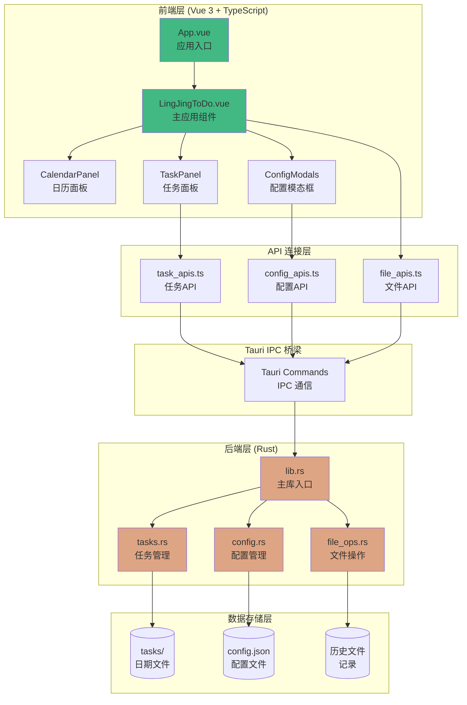

### 技术栈架构

```mermaid
graph LR
    subgraph "前端技术栈"
        A1[Vue 3.5.13<br/>Composition API]
        A2[TypeScript 5.6.2]
        A3[Vite 6.0.3]
        A4[SortableJS 1.15.7]
    end
    
    subgraph "桌面框架"
        B1[Tauri 2.x]
        B2[WebView]
        B3[Rust Runtime]
    end
    
    subgraph "后端技术栈"
        C1[Rust Edition 2021]
        C2[serde + serde_json]
        C3[chrono 0.4.44]
        C4[rust_xlsxwriter]
        C5[calamine]
    end
    
    subgraph "Tauri 插件"
        D1[tauri-plugin-opener]
        D2[tauri-plugin-dialog]
        D3[tauri-plugin-process]
        D4[tauri-plugin-fs]
    end
    
    A1 --> B2
    A3 --> B1
    B1 --> B3
    B3 --> C1
    
    C1 --> C2
    C1 --> C3
    C1 --> C4
    C1 --> C5
    
    B1 --> D1
    B1 --> D2
    B1 --> D3
    B1 --> D4
    
    style A1 fill:#42b883
    style B1 fill:#24292e
    style C1 fill:#dea584
```

---

## 目录结构

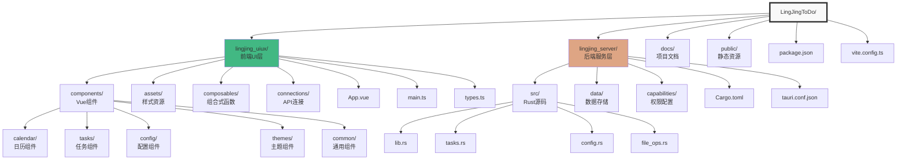

---

## 核心组件架构

### 前端组件层次结构

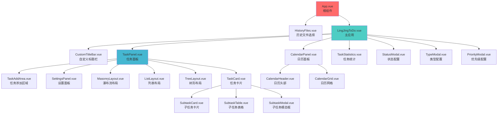

### 后端模块架构

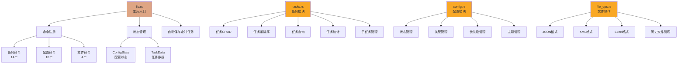

---

## 数据模型

### 核心数据模型关系

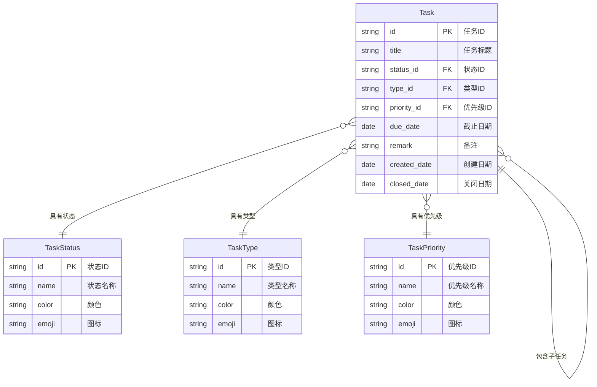

### 数据存储结构

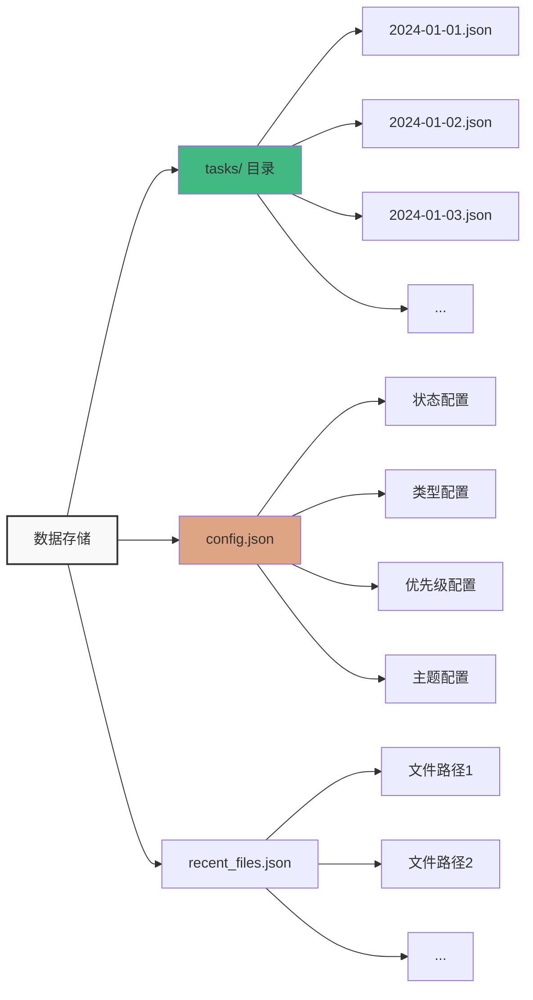

---

## API 接口设计

### API 调用流程

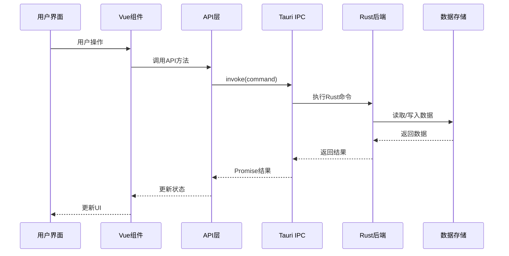

### 任务 API 接口

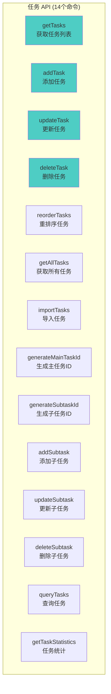

### 配置 API 接口

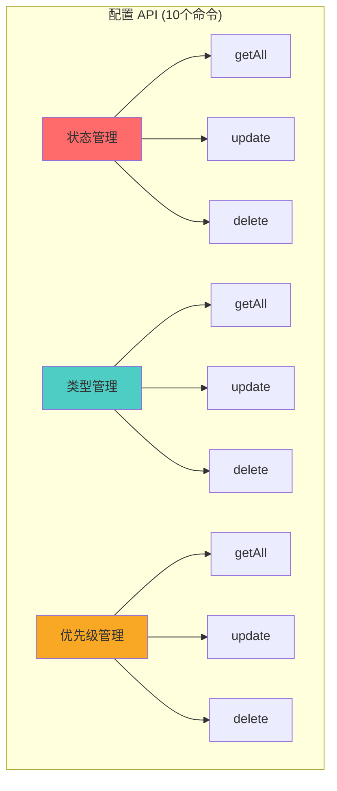

---

## 状态管理流程

### 前端状态管理

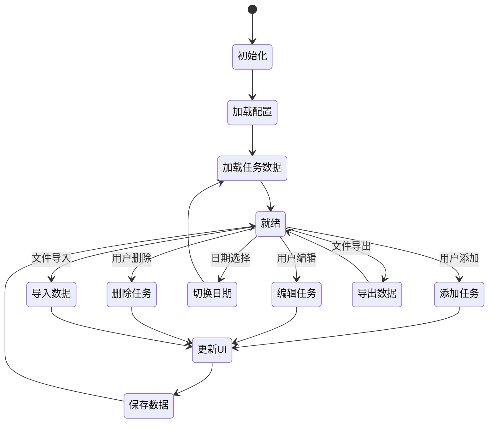

### 数据同步流程

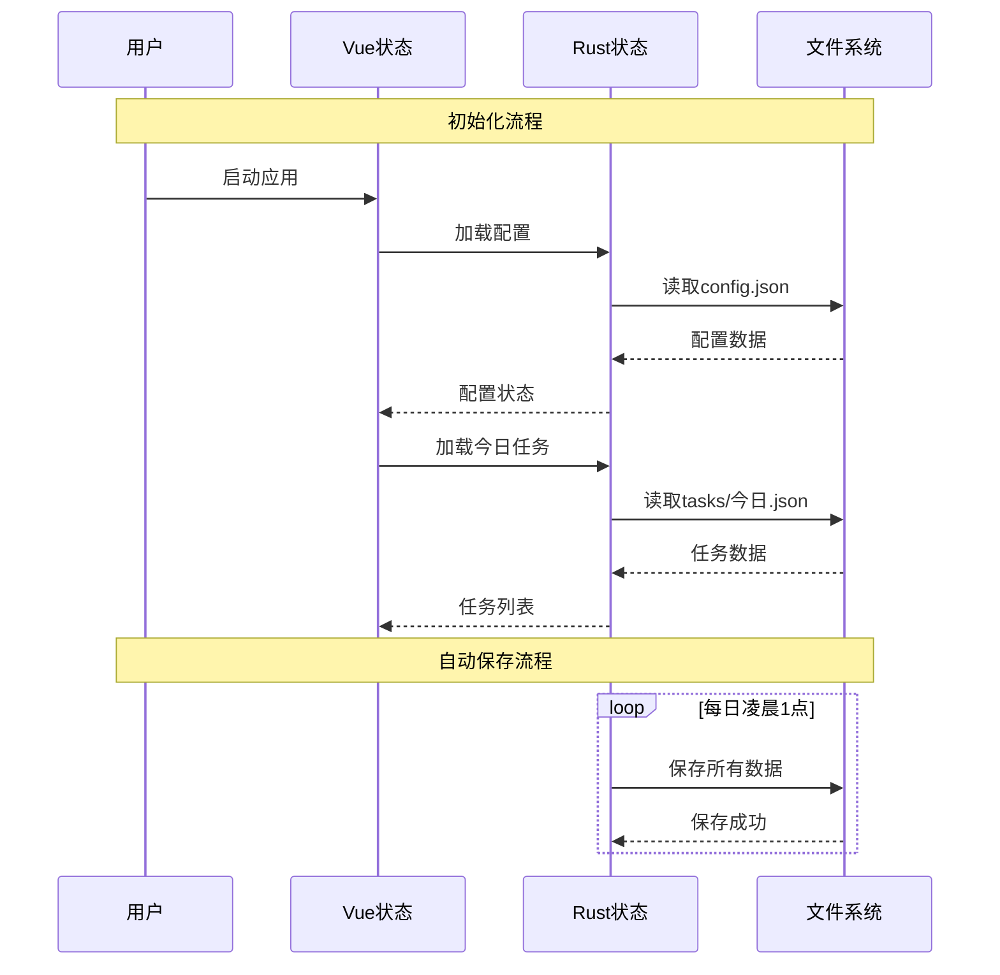

---

## 布局系统

### 三种布局模式

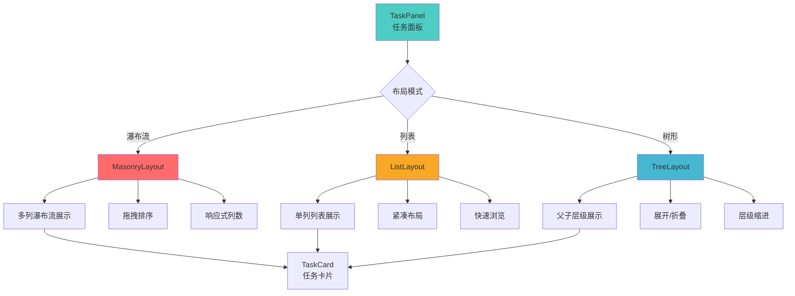

---

## 文件导入导出流程

### 多格式支持

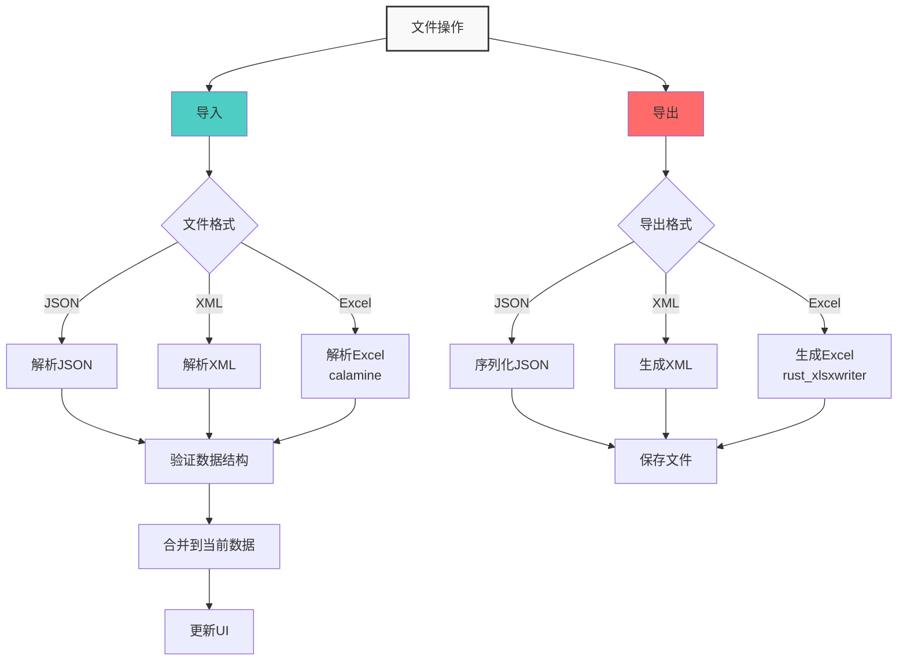

---

## 自动保存机制

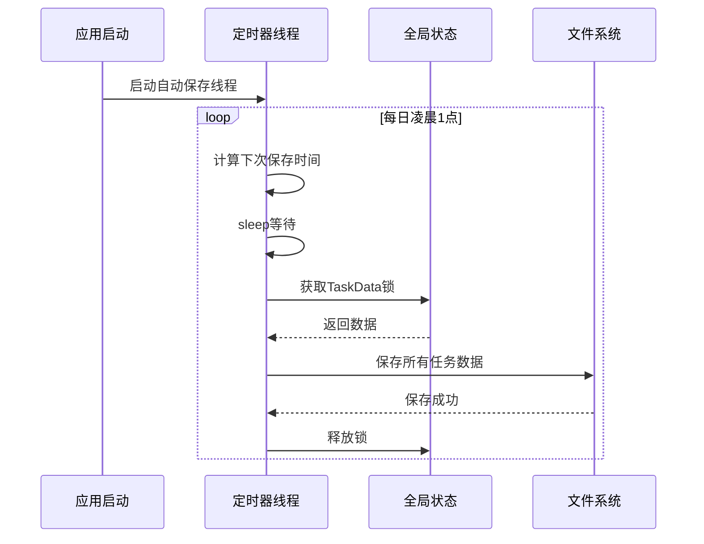

---

## 性能优化建议

### 当前性能瓶颈

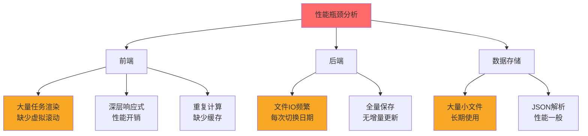

### 优化方案

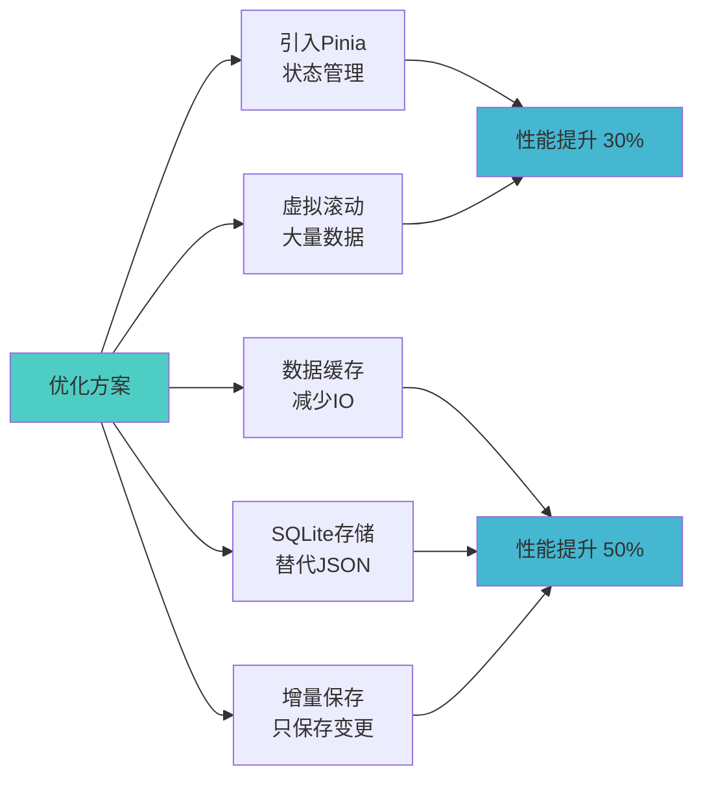

---

## 扩展方向

### 功能扩展路线图

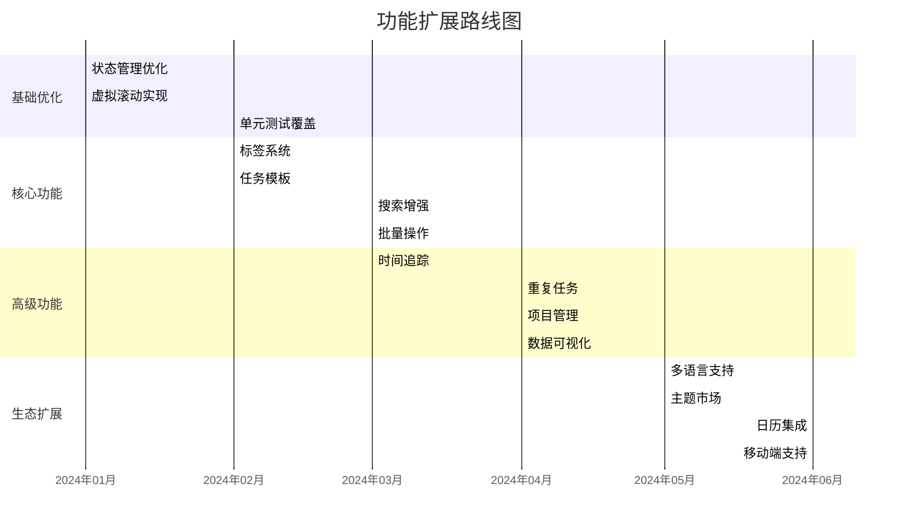

### 技术架构演进

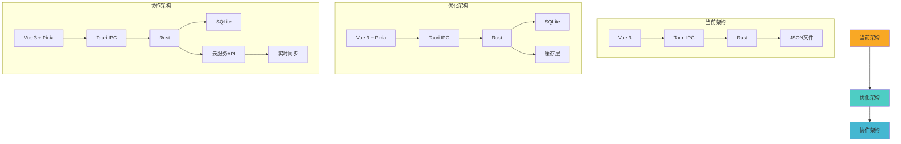

---

## 技术选型建议

### 推荐技术栈

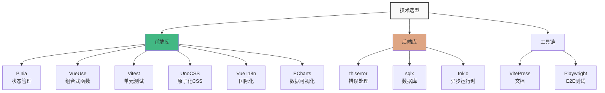

---

## 总结

本项目采用现代化的技术架构，具有以下特点：

1. **清晰的分层架构**：前端、API连接层、后端、数据存储层职责明确
2. **类型安全**：TypeScript + Rust 双重类型保障
3. **高性能**：Rust 后端提供卓越性能
4. **跨平台**：Tauri 实现一次开发，多平台部署
5. **可扩展**：模块化设计，易于功能扩展

通过系统化的优化和功能扩展，本项目可以成长为一款优秀的跨平台任务管理工具。
