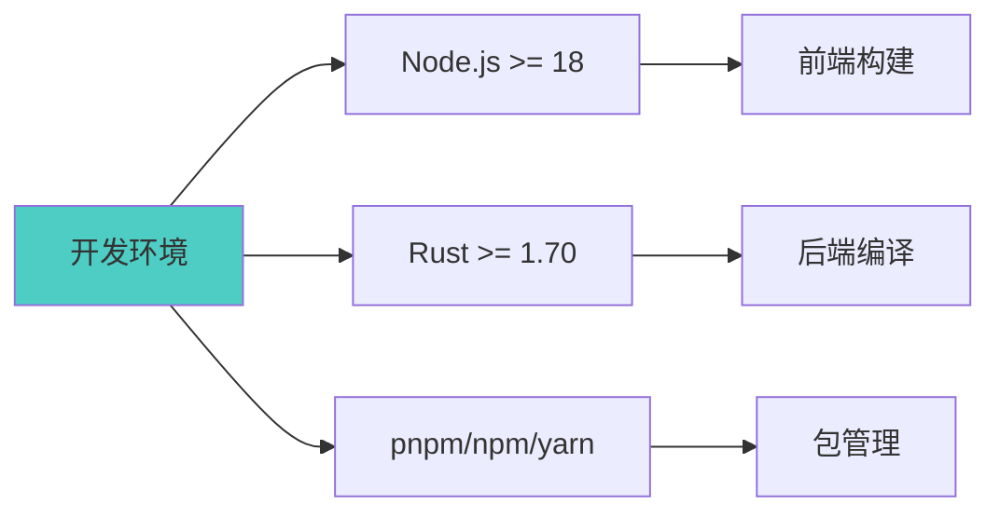
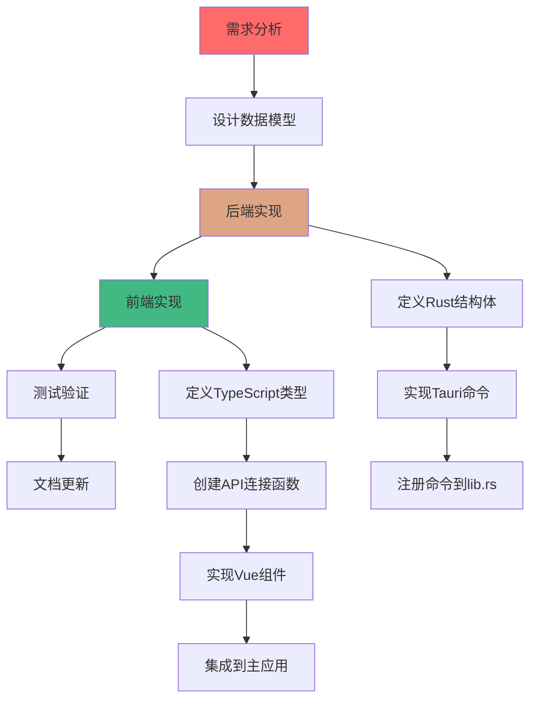
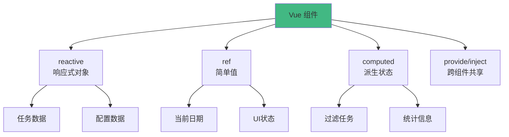
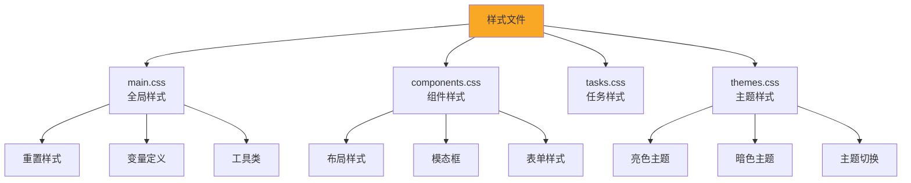
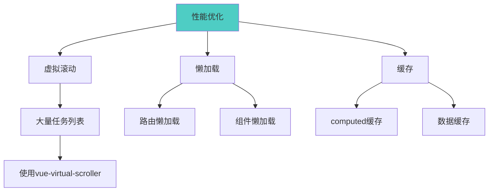
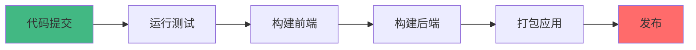

# 灵境待办 - 开发者指南

## 快速开始

### 环境要求



### 安装步骤

1. **克隆项目**
```bash
git clone https://github.com/hemy08/LingJingToDo.git
cd LingJingToDo
```

2. **安装前端依赖**
```bash
npm install
```

3. **安装 Rust 依赖**（Tauri 会自动处理）
```bash
npm run tauri dev
```

4. **开发模式运行**
```bash
npm run tauri:dev
```

5. **生产构建**
```bash
npm run tauri:build
```

---

## 项目结构详解

### 前端目录结构

```
lingjing_uiux/
├── components/              # Vue 组件
│   ├── calendar/           # 日历相关组件
│   │   └── CalendarPanel.vue
│   ├── common/             # 通用组件
│   │   ├── CustomTitleBar.vue
│   │   ├── StatusBar.vue
│   │   └── BottomStatusBar.vue
│   ├── config/             # 配置相关组件
│   │   ├── StatusModal.vue
│   │   ├── TypeModal.vue
│   │   └── PriorityModal.vue
│   ├── tasks/              # 任务相关组件
│   │   ├── TaskPanel.vue
│   │   ├── TaskCard.vue
│   │   ├── TaskAddArea.vue
│   │   ├── MasonryLayout.vue
│   │   ├── ListLayout.vue
│   │   └── TreeLayout.vue
│   ├── themes/             # 主题相关组件
│   │   └── ThemeManager.vue
│   ├── LingJingToDo.vue    # 主应用组件
│   └── HistoryFiles.vue    # 历史文件组件
│
├── assets/                 # 样式资源
│   ├── main.css           # 主样式
│   ├── components.css     # 组件样式
│   ├── tasks.css          # 任务样式
│   ├── themes.css         # 主题样式
│   └── ...
│
├── composables/            # 组合式函数
│   └── useDialog.ts       # 对话框逻辑
│
├── connections/            # API 连接层
│   ├── task_apis.ts       # 任务 API
│   └── config_apis.ts     # 配置 API
│
├── common/                 # 通用组件
│   └── Dialog.vue
│
├── App.vue                 # 根组件
├── main.ts                 # 入口文件
└── types.ts                # 类型定义
```

### 后端目录结构

```
lingjing_server/
├── src/                    # Rust 源码
│   ├── lib.rs             # 主库文件
│   ├── main.rs            # 入口文件
│   ├── tasks.rs           # 任务管理模块
│   ├── config.rs          # 配置管理模块
│   └── file_ops.rs        # 文件操作模块
│
├── data/                   # 数据存储目录
│   ├── tasks/             # 任务数据（按日期）
│   │   ├── 2024-01-01.json
│   │   ├── 2024-01-02.json
│   │   └── ...
│   ├── config.json        # 配置数据
│   └── recent_files.json  # 历史文件记录
│
├── capabilities/           # Tauri 权限配置
│   └── default.json
│
├── Cargo.toml             # Rust 依赖配置
└── tauri.conf.json        # Tauri 配置
```

---

## 核心开发流程

### 添加新功能流程



### 示例：添加"标签"功能

#### 1. 后端实现

**步骤 1：定义数据模型**（修改 `types.ts` 和 Rust 结构体）

```typescript
// lingjing_uiux/types.ts
export interface TaskTag {
  id: string
  name: string
  color: string
}

export interface Task {
  // ... 现有字段
  tags?: string[]  // 添加标签ID数组
}
```

```rust
// lingjing_server/src/tasks.rs
#[derive(Debug, Clone, Serialize, Deserialize)]
pub struct TaskTag {
    pub id: String,
    pub name: String,
    pub color: String,
}

#[derive(Debug, Clone, Serialize, Deserialize)]
pub struct Task {
    // ... 现有字段
    #[serde(skip_serializing_if = "Option::is_none")]
    pub tags: Option<Vec<String>>,
}
```

**步骤 2：实现 Tauri 命令**

```rust
// lingjing_server/src/tasks.rs

#[tauri::command]
pub fn get_all_tags(state: State<Mutex<ConfigState>>) -> Vec<TaskTag> {
    let config = state.lock().unwrap();
    config.tags.clone()
}

#[tauri::command]
pub fn update_tags(state: State<Mutex<ConfigState>>, tags: Vec<TaskTag>) -> Vec<TaskTag> {
    let mut config = state.lock().unwrap();
    config.tags = tags;
    config.save();
    config.tags.clone()
}
```

**步骤 3：注册命令**

```rust
// lingjing_server/src/lib.rs
.invoke_handler(tauri::generate_handler![
    // ... 现有命令
    tasks::get_all_tags,
    tasks::update_tags,
])
```

#### 2. 前端实现

**步骤 1：创建 API 连接**

```typescript
// lingjing_uiux/connections/tag_apis.ts
import { invoke } from '@tauri-apps/api/core'
import type { TaskTag } from '../types'

export const tagApi = {
  async getAll(): Promise<TaskTag[]> {
    return await invoke('get_all_tags')
  },
  
  async update(tags: TaskTag[]): Promise<TaskTag[]> {
    return await invoke('update_tags', { tags })
  }
}
```

**步骤 2：创建 Vue 组件**

```vue
<!-- lingjing_uiux/components/config/TagModal.vue -->
<template>
  <div class="tag-modal">
    <!-- 标签管理界面 -->
  </div>
</template>

<script setup lang="ts">
import { ref, onMounted } from 'vue'
import { tagApi } from '../../connections/tag_apis'
import type { TaskTag } from '../../types'

const tags = ref<TaskTag[]>([])

onMounted(async () => {
  tags.value = await tagApi.getAll()
})
</script>
```

**步骤 3：集成到主应用**

```vue
<!-- lingjing_uiux/components/LingJingToDo.vue -->
<template>
  <!-- 添加标签管理按钮 -->
  <button @click="showTagModal = true">管理标签</button>
  <TagModal v-if="showTagModal" @close="showTagModal = false" />
</template>
```

---

## 状态管理

### 当前状态管理方式



### 推荐使用 Pinia

```typescript
// stores/taskStore.ts
import { defineStore } from 'pinia'
import { taskApi } from '../connections/task_apis'
import type { Task } from '../types'

export const useTaskStore = defineStore('tasks', {
  state: () => ({
    tasks: [] as Task[],
    currentDate: new Date().toISOString().split('T')[0],
    loading: false
  }),
  
  getters: {
    completedTasks: (state) => state.tasks.filter(t => t.status_id === 'completed'),
    pendingTasks: (state) => state.tasks.filter(t => t.status_id !== 'completed')
  },
  
  actions: {
    async loadTasks(date: string) {
      this.loading = true
      try {
        this.tasks = await taskApi.getTasks(date)
        this.currentDate = date
      } finally {
        this.loading = false
      }
    },
    
    async addTask(task: Task) {
      const newTask = await taskApi.addTask(this.currentDate, task)
      this.tasks.push(newTask)
    }
  }
})
```

---

## 样式开发

### CSS 组织结构



### 主题系统

```css
/* themes.css */
:root {
  /* 亮色主题 */
  --primary-color: #4ecdc4;
  --background-color: #ffffff;
  --text-color: #333333;
}

[data-theme="dark"] {
  /* 暗色主题 */
  --primary-color: #45b7d1;
  --background-color: #1a1a1a;
  --text-color: #ffffff;
}
```

---

## 测试

### 单元测试（Vitest）

```typescript
// tests/taskStore.test.ts
import { describe, it, expect } from 'vitest'
import { useTaskStore } from '../stores/taskStore'

describe('TaskStore', () => {
  it('should filter completed tasks', () => {
    const store = useTaskStore()
    store.tasks = [
      { id: '1', status_id: 'completed', title: 'Task 1' },
      { id: '2', status_id: 'pending', title: 'Task 2' }
    ]
    
    expect(store.completedTasks.length).toBe(1)
    expect(store.completedTasks[0].id).toBe('1')
  })
})
```

### E2E 测试（Playwright）

```typescript
// e2e/task.spec.ts
import { test, expect } from '@playwright/test'

test('should add a new task', async ({ page }) => {
  await page.goto('/')
  
  await page.click('[data-testid="add-task-button"]')
  await page.fill('[data-testid="task-title"]', 'New Task')
  await page.click('[data-testid="save-button"]')
  
  await expect(page.locator('.task-card')).toContainText('New Task')
})
```

---

## 调试技巧

### 前端调试

```typescript
// 使用 Vue DevTools
// 安装 Vue DevTools 浏览器扩展

// 在代码中添加断点
debugger

// 使用 console.log 调试
console.log('Current tasks:', tasks.value)
```

### 后端调试

```rust
// 使用 log 库记录日志
use log::{info, debug, error};

#[tauri::command]
pub fn add_task(task: Task) -> Task {
    info!("Adding task: {:?}", task);
    // ...
}
```

```bash
# 运行时启用日志
RUST_LOG=debug npm run tauri:dev
```

---

## 性能优化

### 前端优化



**虚拟滚动示例**

```vue
<template>
  <RecycleScroller
    :items="tasks"
    :item-size="100"
    key-field="id"
  >
    <template #default="{ item }">
      <TaskCard :task="item" />
    </template>
  </RecycleScroller>
</template>

<script setup>
import { RecycleScroller } from 'vue-virtual-scroller'
</script>
```

### 后端优化

```rust
// 使用异步操作
use tokio::runtime::Runtime;

#[tauri::command]
pub async fn load_all_tasks() -> Result<HashMap<String, Vec<Task>>, String> {
    tokio::task::spawn_blocking(|| {
        // 在独立线程中执行文件IO
        load_tasks_from_disk()
    }).await.map_err(|e| e.to_string())?
}
```

---

## 常见问题

### Q1: Tauri 命令调用失败

**问题**: `Error: Command not found`

**解决方案**:
1. 检查命令是否在 `lib.rs` 中注册
2. 确保命令名称拼写正确
3. 重新编译项目

### Q2: 数据保存失败

**问题**: 文件写入权限错误

**解决方案**:
1. 检查 `data/` 目录权限
2. 确保路径正确
3. 查看 Tauri 权限配置

### Q3: 样式不生效

**问题**: CSS 样式未应用

**解决方案**:
1. 检查样式文件是否导入
2. 确认选择器优先级
3. 使用浏览器开发者工具检查

---

## 发布流程

### 构建发布版本



```bash
# 1. 运行测试
npm run test

# 2. 构建生产版本
npm run tauri:build

# 3. 输出位置
# Windows: src-tauri/target/release/bundle/msi/
# macOS: src-tauri/target/release/bundle/dmg/
# Linux: src-tauri/target/release/bundle/deb/
```

---

## 贡献指南

### 提交代码流程

1. Fork 项目
2. 创建功能分支 (`git checkout -b feature/AmazingFeature`)
3. 提交更改 (`git commit -m 'Add some AmazingFeature'`)
4. 推送到分支 (`git push origin feature/AmazingFeature`)
5. 创建 Pull Request

### 代码规范

- **前端**: 遵循 Vue 官方风格指南
- **后端**: 遵循 Rust 官方编码规范
- **提交信息**: 使用约定式提交格式

---

## 相关资源

- [Tauri 官方文档](https://tauri.app/v2/guide/)
- [Vue 3 官方文档](https://vuejs.org/)
- [Rust 官方文档](https://doc.rust-lang.org/)
- [TypeScript 官方文档](https://www.typescriptlang.org/)
