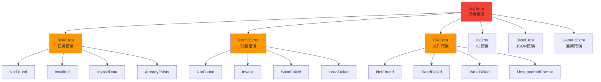
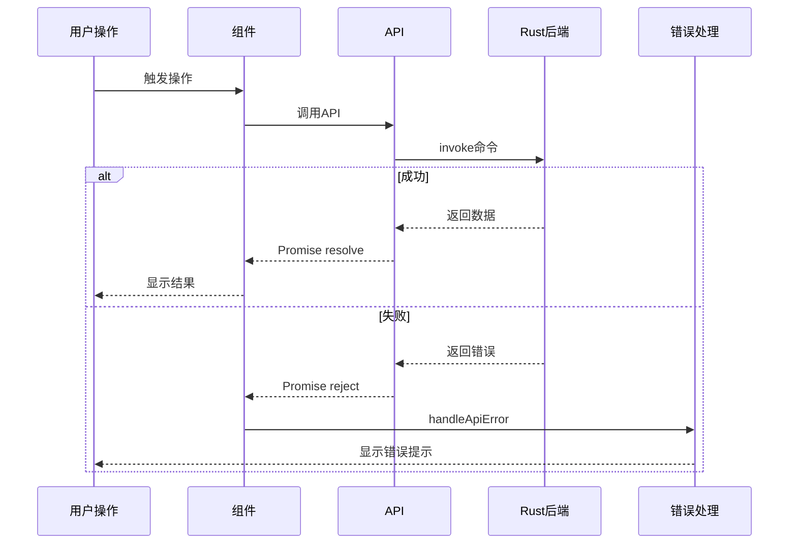
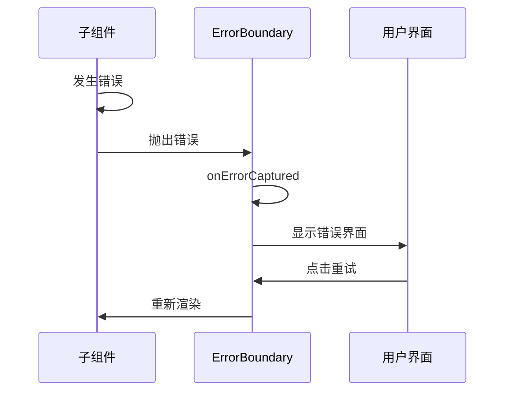

# 错误处理增强指南

## 概述

本项目已实现完整的错误处理机制，包括 Rust 端自定义错误类型、前端错误边界和统一错误提示组件。

---

## Rust 端错误处理

### 1. 自定义错误类型

#### 错误类型层次



#### 错误定义

```rust
use thiserror::Error;

/// 应用程序错误类型
#[derive(Error, Debug)]
pub enum AppError {
    /// 任务相关错误
    #[error("Task error: {0}")]
    Task(#[from] TaskError),
    
    /// 配置相关错误
    #[error("Config error: {0}")]
    Config(#[from] ConfigError),
    
    /// 文件操作错误
    #[error("File error: {0}")]
    File(#[from] FileError),
    
    /// IO 错误
    #[error("IO error: {0}")]
    Io(#[from] std::io::Error),
    
    /// JSON 解析错误
    #[error("JSON error: {0}")]
    Json(#[from] serde_json::Error),
    
    /// 通用错误
    #[error("{0}")]
    Generic(String),
}
```

### 2. 使用示例

#### 在 Tauri 命令中使用

```rust
use crate::error::{AppError, TaskError, AppResult};

#[tauri::command]
pub fn get_task(
    date: String,
    task_id: String,
    state: State<Mutex<TaskData>>,
) -> AppResult<Task> {
    let task_data = state.lock().unwrap();
    
    // 获取任务
    let tasks = task_data.tasks.get(&date)
        .ok_or_else(|| TaskError::NotFound(format!("Date {} not found", date)))?;
    
    let task = tasks.iter()
        .find(|t| t.id == task_id)
        .ok_or_else(|| TaskError::NotFound(task_id.clone()))?;
    
    Ok(task.clone())
}
```

#### 错误转换

```rust
// 自动转换
fn read_config() -> AppResult<Config> {
    let content = fs::read_to_string("config.json")?; // 自动转换为 AppError::Io
    let config = serde_json::from_str(&content)?;     // 自动转换为 AppError::Json
    Ok(config)
}

// 手动转换
fn validate_task(task: &Task) -> AppResult<()> {
    if task.title.is_empty() {
        return Err(TaskError::InvalidData("Title cannot be empty".to_string()).into());
    }
    Ok(())
}
```

### 3. 错误响应

#### ErrorResponse 结构

```rust
#[derive(Debug, Serialize)]
pub struct ErrorResponse {
    pub error_type: String,
    pub message: String,
    pub details: Option<String>,
}
```

#### 转换为响应

```rust
impl From<AppError> for ErrorResponse {
    fn from(error: AppError) -> Self {
        match error {
            AppError::Task(e) => ErrorResponse {
                error_type: "TaskError".to_string(),
                message: e.to_string(),
                details: None,
            },
            // ... 其他错误类型
        }
    }
}
```

---

## 前端错误处理

### 1. 错误边界组件

#### ErrorBoundary 组件

**功能**:
- 捕获子组件错误
- 显示友好的错误界面
- 提供重试和重置功能

**使用方式**:

```vue
<template>
  <ErrorBoundary @retry="handleRetry" @reset="handleReset">
    <!-- 可能出错的组件 -->
    <TaskPanel />
  </ErrorBoundary>
</template>

<script setup>
import ErrorBoundary from './components/common/ErrorBoundary.vue'

function handleRetry() {
  console.log('重试操作')
}

function handleReset() {
  console.log('重置应用')
}
</script>
```

**特性**:
- ✅ 自动捕获子组件错误
- ✅ 显示错误信息和堆栈
- ✅ 提供重试按钮
- ✅ 提供重置按钮
- ✅ 支持暗色主题

### 2. 错误提示组件

#### ErrorToast 组件

**类型**:
- `error` - 错误（红色）
- `warning` - 警告（橙色）
- `info` - 信息（蓝色）
- `success` - 成功（绿色）

**使用方式**:

```vue
<template>
  <ErrorToast
    type="error"
    title="操作失败"
    message="无法加载任务数据"
    :duration="5000"
    @close="handleClose"
  />
</template>
```

### 3. 错误处理组合式函数

#### useErrorHandling

```typescript
import { useErrorHandling } from '../composables/useErrorHandling'

const {
  showError,
  showWarning,
  showInfo,
  showSuccess,
  handleApiError,
  withErrorHandling
} = useErrorHandling()

// 显示错误
showError('操作失败', '详细错误信息')

// 显示警告
showWarning('注意', '数据可能不完整')

// 显示信息
showInfo('提示', '数据已保存')

// 显示成功
showSuccess('成功', '任务已创建')

// 处理 API 错误
try {
  await taskApi.addTask(task)
} catch (error) {
  handleApiError(error, '添加任务失败')
}

// 异步操作包装器
const result = await withErrorHandling(
  () => taskApi.addTask(task),
  '添加任务失败'
)
```

### 4. 全局错误处理

#### 设置全局错误处理器

```typescript
// main.ts
import { setupGlobalErrorHandler } from './composables/useErrorHandling'

// 设置全局错误处理
setupGlobalErrorHandler()

// 创建应用
const app = createApp(App)
app.use(pinia)
app.mount('#app')
```

**处理的错误类型**:
- 未捕获的 Promise 错误（`unhandledrejection`）
- 未捕获的 JavaScript 错误（`error`）

---

## 错误处理流程

### API 调用错误处理



### 组件错误处理



---

## 最佳实践

### 1. Rust 端

#### 使用具体的错误类型

```rust
// ✅ 推荐：使用具体错误类型
return Err(TaskError::NotFound(task_id));

// ❌ 不推荐：使用通用字符串
return Err(AppError::Generic("Task not found".to_string()));
```

#### 提供有意义的错误信息

```rust
// ✅ 推荐：包含上下文信息
TaskError::NotFound(format!("Task {} not found in date {}", task_id, date))

// ❌ 不推荐：信息不足
TaskError::NotFound(task_id)
```

#### 使用 `?` 运算符

```rust
// ✅ 推荐：自动错误转换
fn load_config() -> AppResult<Config> {
    let content = fs::read_to_string("config.json")?;
    let config = serde_json::from_str(&content)?;
    Ok(config)
}

// ❌ 不推荐：手动处理
fn load_config() -> AppResult<Config> {
    let content = match fs::read_to_string("config.json") {
        Ok(c) => c,
        Err(e) => return Err(AppError::Io(e)),
    };
    // ...
}
```

### 2. 前端

#### 使用错误边界包裹关键组件

```vue
<template>
  <ErrorBoundary>
    <RouterView />
  </ErrorBoundary>
</template>
```

#### 使用 withErrorHandling 包装异步操作

```typescript
// ✅ 推荐：自动错误处理
const tasks = await withErrorHandling(
  () => taskApi.getTasks(date),
  '加载任务失败'
)

// ❌ 不推荐：手动 try-catch
try {
  const tasks = await taskApi.getTasks(date)
} catch (error) {
  console.error(error)
  showError('加载任务失败')
}
```

#### 提供用户友好的错误信息

```typescript
// ✅ 推荐：用户友好的信息
showError('无法加载任务', '请检查网络连接后重试')

// ❌ 不推荐：技术性错误信息
showError('Error: Network request failed')
```

---

## 错误类型对照表

### Rust 错误类型

| 错误类型 | 说明 | 示例 |
|---------|------|------|
| TaskError::NotFound | 任务未找到 | `TaskError::NotFound("task-123")` |
| TaskError::InvalidId | 无效任务ID | `TaskError::InvalidId("invalid")` |
| TaskError::InvalidData | 无效任务数据 | `TaskError::InvalidData("empty title")` |
| ConfigError::NotFound | 配置未找到 | `ConfigError::NotFound("config.json")` |
| ConfigError::Invalid | 无效配置 | `ConfigError::Invalid("missing field")` |
| FileError::NotFound | 文件未找到 | `FileError::NotFound("data.json")` |
| FileError::UnsupportedFormat | 不支持的格式 | `FileError::UnsupportedFormat("pdf")` |

### 前端错误类型

| 错误类型 | 图标 | 颜色 | 用途 |
|---------|------|------|------|
| error | ❌ | 红色 | 严重错误 |
| warning | ⚠️ | 橙色 | 警告信息 |
| info | ℹ️ | 蓝色 | 提示信息 |
| success | ✅ | 绿色 | 成功信息 |

---

## 测试

### Rust 错误测试

```rust
#[cfg(test)]
mod tests {
    use super::*;

    #[test]
    fn test_task_error() {
        let error = TaskError::NotFound("task-123".to_string());
        assert_eq!(error.to_string(), "Task not found: task-123");
    }

    #[test]
    fn test_error_conversion() {
        let io_error = std::io::Error::new(
            std::io::ErrorKind::NotFound,
            "file not found"
        );
        let app_error: AppError = io_error.into();
        assert!(matches!(app_error, AppError::Io(_)));
    }
}
```

### 前端错误测试

```typescript
import { useErrorHandling } from '../composables/useErrorHandling'

describe('useErrorHandling', () => {
  it('should show error toast', () => {
    const { showError, toasts } = useErrorHandling()
    showError('Test error', 'Test message')
    
    expect(toasts.value.length).toBe(1)
    expect(toasts.value[0].props.type).toBe('error')
    expect(toasts.value[0].props.title).toBe('Test error')
  })
})
```

---

## 相关资源

- [thiserror 文档](https://docs.rs/thiserror/)
- [Vue 3 错误处理](https://vuejs.org/api/composition-api-lifecycle-hooks.html#onerrorcaptured)
- [TypeScript 错误处理](https://www.typescriptlang.org/docs/handbook/2/functions.html#return-type-void)
