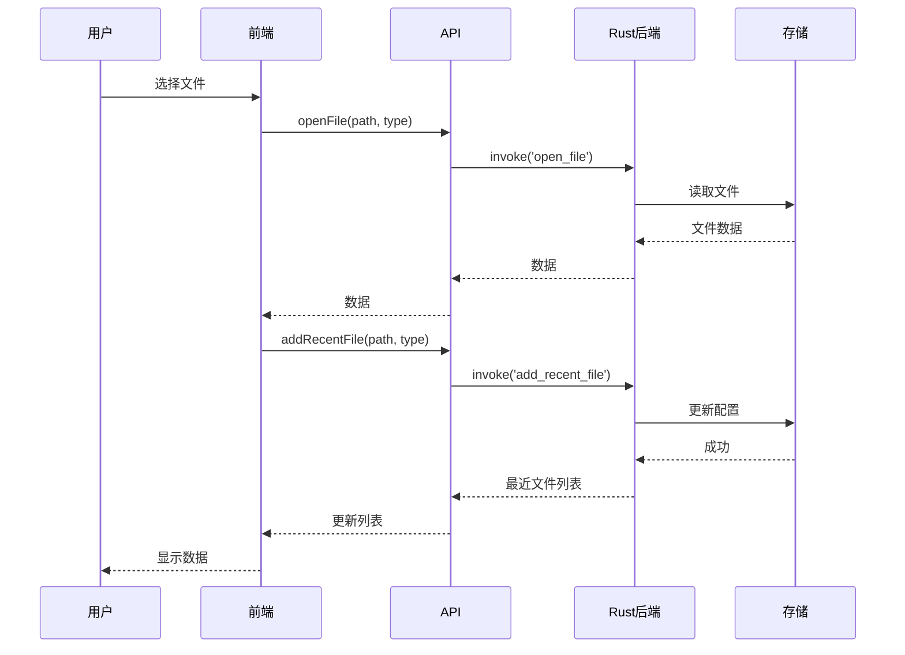
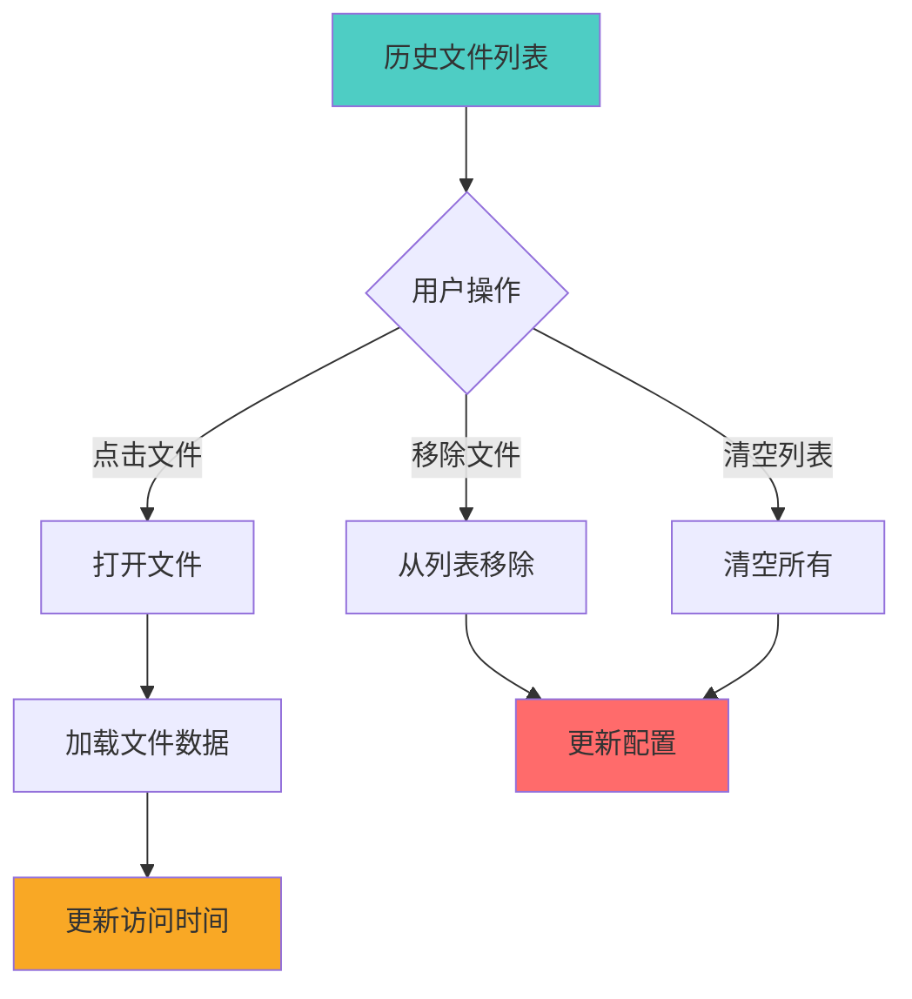

# 历史文件列表增强功能

## 概述

本项目已增强历史文件列表功能，支持 JSON、XML、Excel 三种格式的记录和管理。

---

## 功能特性

### 1. 多格式支持

#### 支持的文件格式

| 格式 | 扩展名 | 图标 | 颜色 | 说明 |
|------|--------|------|------|------|
| JSON | `.json` | 📄 | 绿色 | JSON 数据文件 |
| XML | `.xml` | 📋 | 橙色 | XML 数据文件 |
| Excel | `.xlsx`, `.xls` | 📊 | 蓝色 | Excel 电子表格 |

#### 文件类型枚举

```typescript
export enum FileType {
  JSON = 'json',
  XML = 'xml',
  Excel = 'excel'
}
```

---

### 2. 历史文件记录结构

#### RecentFile 接口

```typescript
export interface RecentFile {
  /** 文件路径 */
  path: string
  /** 文件类型 */
  type: FileType
  /** 文件名 */
  name: string
  /** 最后访问时间 */
  last_accessed: string
  /** 文件大小（字节） */
  size?: number
}
```

#### 示例数据

```json
{
  "path": "/path/to/tasks.json",
  "type": "json",
  "name": "tasks.json",
  "last_accessed": "2024-01-15T10:30:00Z",
  "size": 15360
}
```

---

### 3. 文件类型工具函数

#### FileTypeUtils

```typescript
import { FileTypeUtils } from '../types'

// 根据文件路径推断类型
const type = FileTypeUtils.inferFromFile('/path/to/data.xml')
// 返回: FileType.XML

// 获取显示名称
const name = FileTypeUtils.getDisplayName(FileType.JSON)
// 返回: 'JSON'

// 获取图标
const icon = FileTypeUtils.getIcon(FileType.Excel)
// 返回: '📊'

// 获取颜色
const color = FileTypeUtils.getColor(FileType.XML)
// 返回: '#FF9800'

// 获取扩展名
const ext = FileTypeUtils.getExtension(FileType.JSON)
// 返回: '.json'
```

---

## API 接口

### file_apis.ts

#### 获取最近文件列表

```typescript
const recentFiles = await fileApi.getRecentFiles()
// 返回: RecentFile[]
```

#### 添加到最近文件列表

```typescript
// 自动推断文件类型
await fileApi.addRecentFile('/path/to/data.json')

// 指定文件类型
await fileApi.addRecentFile('/path/to/data.xml', 'xml')
```

#### 打开文件

```typescript
const data = await fileApi.openFile(
  '/path/to/data.json',
  'json'
)
```

#### 保存文件

```typescript
await fileApi.saveFile(
  '/path/to/data.xml',
  'xml',
  taskData
)
```

#### 移除文件

```typescript
await fileApi.removeRecentFile('/path/to/data.json')
```

#### 清空列表

```typescript
await fileApi.clearRecentFiles()
```

---

## 组件使用

### HistoryFilesEnhanced 组件

#### 基础用法

```vue
<template>
  <HistoryFilesEnhanced 
    @file-opened="handleFileOpened"
  />
</template>

<script setup>
import HistoryFilesEnhanced from './components/HistoryFilesEnhanced.vue'

function handleFileOpened({ path, type, data }) {
  console.log('打开文件:', path)
  console.log('文件类型:', type)
  console.log('文件数据:', data)
  
  // 处理文件数据
  // ...
}
</script>
```

#### 组件特性

- ✅ 显示文件图标（根据类型）
- ✅ 显示文件类型标签
- ✅ 显示最后访问时间（智能格式化）
- ✅ 显示文件大小
- ✅ 支持移除单个文件
- ✅ 支持清空整个列表
- ✅ 悬停效果和动画
- ✅ 暗色主题支持

---

## 时间格式化

### 智能时间显示

| 时间差 | 显示格式 |
|--------|---------|
| < 1分钟 | "刚刚" |
| < 1小时 | "X分钟前" |
| < 1天 | "X小时前" |
| < 7天 | "X天前" |
| >= 7天 | "YYYY-MM-DD" |

### 示例

```typescript
formatTime('2024-01-15T10:30:00Z')
// 根据当前时间返回：
// - "刚刚"（1分钟内）
// - "5分钟前"（1小时内）
// - "2小时前"（1天内）
// - "3天前"（7天内）
// - "2024-01-10"（7天前）
```

---

## 文件大小格式化

### 智能大小显示

| 大小范围 | 显示格式 |
|---------|---------|
| < 1 KB | "X B" |
| < 1 MB | "X KB" |
| < 1 GB | "X MB" |
| >= 1 GB | "X GB" |

### 示例

```typescript
formatSize(512)        // "512 B"
formatSize(1536)       // "1.5 KB"
formatSize(1572864)    // "1.5 MB"
formatSize(1610612736) // "1.5 GB"
```

---

## 后端实现

### Rust 数据结构

```rust
#[derive(Debug, Clone, Serialize, Deserialize)]
pub struct RecentFile {
    pub path: String,
    pub file_type: String,  // "json" | "xml" | "excel"
    pub name: String,
    pub last_accessed: String,
    pub size: Option<u64>,
}

pub struct Config {
    pub recent_files: Vec<RecentFile>,
    // ... 其他配置
}
```

### Tauri 命令

```rust
#[tauri::command]
pub fn get_recent_files(
    state: State<ConfigState>
) -> Vec<RecentFile> {
    let config = state.config.lock().unwrap();
    config.recent_files.clone()
}

#[tauri::command]
pub fn add_recent_file(
    state: State<ConfigState>,
    file_path: String,
    file_type: String,
) -> Vec<RecentFile> {
    let mut config = state.config.lock().unwrap();
    
    // 移除已存在的相同路径
    config.recent_files.retain(|f| f.path != file_path);
    
    // 添加新记录
    let recent_file = RecentFile {
        path: file_path.clone(),
        file_type,
        name: get_file_name(&file_path),
        last_accessed: chrono::Local::now().to_rfc3339(),
        size: get_file_size(&file_path),
    };
    
    config.recent_files.insert(0, recent_file);
    
    // 限制数量
    if config.recent_files.len() > 10 {
        config.recent_files.truncate(10);
    }
    
    let result = config.recent_files.clone();
    drop(config);
    state.save();
    result
}

#[tauri::command]
pub fn remove_recent_file(
    state: State<ConfigState>,
    file_path: String,
) -> Vec<RecentFile> {
    let mut config = state.config.lock().unwrap();
    config.recent_files.retain(|f| f.path != file_path);
    
    let result = config.recent_files.clone();
    drop(config);
    state.save();
    result
}

#[tauri::command]
pub fn clear_recent_files(
    state: State<ConfigState>,
) {
    let mut config = state.config.lock().unwrap();
    config.recent_files.clear();
    drop(config);
    state.save();
}
```

---

## 使用流程

### 1. 打开文件



### 2. 管理历史



---

## 最佳实践

### 1. 自动推断文件类型

```typescript
// ✅ 推荐：让系统自动推断
await fileApi.addRecentFile('/path/to/data.xml')

// ✅ 也可以：明确指定类型
await fileApi.addRecentFile('/path/to/data', 'xml')
```

### 2. 错误处理

```typescript
try {
  const data = await fileApi.openFile(path, type)
  // 处理数据
} catch (error) {
  console.error('打开文件失败:', error)
  alert(`打开文件失败: ${error}`)
}
```

### 3. 更新 UI

```typescript
// 添加文件后更新列表
const updatedList = await fileApi.addRecentFile(path, type)
recentFiles.value = updatedList

// 或重新加载
await loadRecentFiles()
```

---

## 样式定制

### 自定义文件类型颜色

```css
/* 在组件中覆盖颜色 */
.file-icon.json {
  color: #4CAF50;
}

.file-icon.xml {
  color: #FF9800;
}

.file-icon.excel {
  color: #2196F3;
}
```

### 自定义文件类型图标

```typescript
// 在 FileTypeUtils 中修改
export function getIcon(type: FileType): string {
  switch (type) {
    case FileType.JSON:
      return '📄'  // 自定义图标
    case FileType.XML:
      return '📋'
    case FileType.Excel:
      return '📊'
  }
}
```

---

## 迁移指南

### 从旧版本迁移

#### 1. 更新类型定义

```typescript
// 旧版本
recent_files: Vec<String>

// 新版本
recent_files: Vec<RecentFile>
```

#### 2. 更新配置文件

```json
// 旧版本 config.json
{
  "recent_files": [
    "/path/to/file1.json",
    "/path/to/file2.xml"
  ]
}

// 新版本 config.json
{
  "recent_files": [
    {
      "path": "/path/to/file1.json",
      "type": "json",
      "name": "file1.json",
      "last_accessed": "2024-01-15T10:30:00Z",
      "size": 15360
    },
    {
      "path": "/path/to/file2.xml",
      "type": "xml",
      "name": "file2.xml",
      "last_accessed": "2024-01-14T15:20:00Z",
      "size": 8192
    }
  ]
}
```

#### 3. 自动迁移

首次运行新版本时，系统会自动迁移旧数据：

```rust
// 检测旧格式并迁移
if let Some(old_files) = config.get("recent_files_old") {
    let new_files: Vec<RecentFile> = old_files
        .into_iter()
        .map(|path| RecentFile::from_path(path))
        .collect();
    config.recent_files = new_files;
}
```

---

## 未来扩展

### 1. 文件预览

```typescript
// 添加预览功能
interface RecentFile {
  // ... 现有字段
  preview?: string  // 文件预览（前几行）
}
```

### 2. 文件分组

```typescript
// 按类型分组
const groupedFiles = {
  json: recentFiles.filter(f => f.type === FileType.JSON),
  xml: recentFiles.filter(f => f.type === FileType.XML),
  excel: recentFiles.filter(f => f.type === FileType.Excel)
}
```

### 3. 文件搜索

```typescript
// 搜索历史文件
function searchRecentFiles(query: string) {
  return recentFiles.filter(f => 
    f.name.includes(query) || f.path.includes(query)
  )
}
```

---

## 相关资源

- [Tauri 文件系统 API](https://tauri.app/v2/api/js/fileSystem)
- [TypeScript 枚举](https://www.typescriptlang.org/docs/handbook/enums.html)
- [Vue 3 组件](https://vuejs.org/guide/essentials/component-basics.html)
