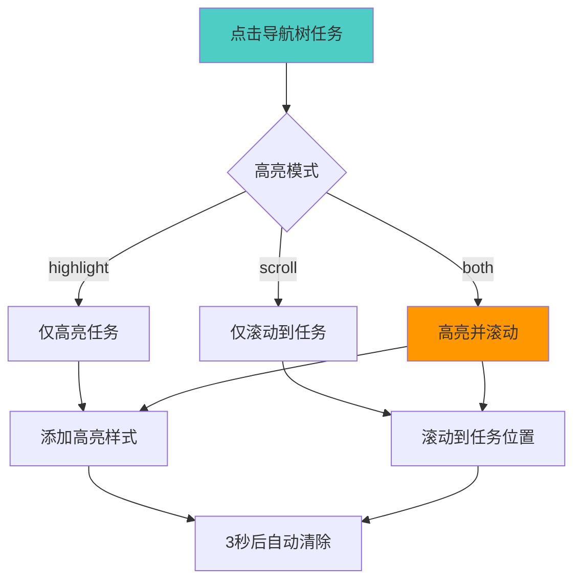
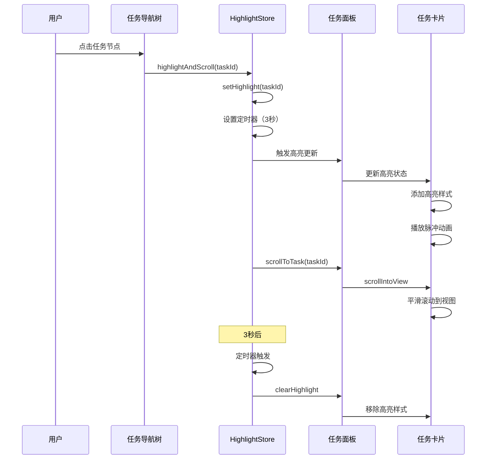

# 任务导航树高亮功能

## 概述

本项目已实现任务导航树与任务面板之间的交互功能，点击导航树中的任务时，任务面板会自动高亮并滚动到对应任务。

---

## 功能特性

### 1. 任务高亮状态管理

#### taskHighlightStore

**状态**:
- `highlightedTaskId` - 当前高亮的任务 ID
- `highlightMode` - 高亮模式（highlight、scroll、both）
- `highlightDuration` - 高亮持续时间（默认 3000ms）

**Getters**:
- `hasHighlight` - 是否有高亮任务
- `currentHighlight` - 获取当前高亮任务 ID

**Actions**:
- `setHighlight(taskId, options)` - 设置高亮任务
- `clearHighlight()` - 清除高亮
- `isHighlighted(taskId)` - 检查任务是否高亮
- `toggleHighlight(taskId)` - 切换高亮
- `scrollToTask(taskId)` - 滚动到任务
- `highlightAndScroll(taskId, duration)` - 高亮并滚动

---

### 2. 高亮模式



---

## 使用方式

### 1. 在任务导航树中使用

```vue
<template>
  <div class="task-tree">
    <TaskTreeNode
      v-for="task in tasks"
      :key="task.id"
      :task="task"
      @task-click="handleTaskClick"
    />
  </div>
</template>

<script setup>
import TaskTreeNode from './TaskTreeNode.vue'
import { useTaskHighlightStore } from '../../stores/taskHighlightStore'

const taskHighlightStore = useTaskHighlightStore()

function handleTaskClick(task) {
  // 高亮并滚动到任务
  taskHighlightStore.highlightAndScroll(task.id, 3000)
}
</script>
```

### 2. 在任务面板中使用

```vue
<template>
  <div class="task-panel">
    <TaskCardHighlight
      v-for="task in tasks"
      :key="task.id"
      :task="task"
    >
      <!-- 任务卡片内容 -->
      <div class="task-content">
        {{ task.title }}
      </div>
    </TaskCardHighlight>
  </div>
</template>

<script setup>
import TaskCardHighlight from './TaskCardHighlight.vue'
</script>
```

### 3. 手动控制高亮

```typescript
import { useTaskHighlightStore } from '../stores/taskHighlightStore'

const taskHighlightStore = useTaskHighlightStore()

// 设置高亮（仅高亮）
taskHighlightStore.setHighlight('task-123', { 
  mode: 'highlight',
  duration: 5000 
})

// 滚动到任务（仅滚动）
taskHighlightStore.scrollToTask('task-123')

// 高亮并滚动
taskHighlightStore.highlightAndScroll('task-123', 3000)

// 清除高亮
taskHighlightStore.clearHighlight()

// 检查是否高亮
if (taskHighlightStore.isHighlighted('task-123')) {
  console.log('任务已高亮')
}
```

---

## 组件说明

### TaskTreeNode 组件

**功能**:
- 显示任务树节点
- 支持嵌套子任务
- 点击时触发高亮和滚动
- 显示任务状态图标

**Props**:
- `task: Task` - 任务对象
- `depth?: number` - 嵌套深度（默认 0）

**Events**:
- `task-click` - 任务点击事件

**示例**:

```vue
<TaskTreeNode
  :task="task"
  :depth="0"
  @task-click="handleClick"
/>
```

### TaskCardHighlight 组件

**功能**:
- 包装任务卡片
- 添加高亮样式和动画
- 支持悬停效果

**Props**:
- `task: Task` - 任务对象

**Slots**:
- default - 任务卡片内容

**示例**:

```vue
<TaskCardHighlight :task="task">
  <div class="task-content">
    <!-- 任务内容 -->
  </div>
</TaskCardHighlight>
```

---

## 样式效果

### 高亮动画

```css
/* 高亮脉冲动画 */
@keyframes highlight-pulse {
  0% {
    box-shadow: 0 0 0 0 rgba(33, 150, 243, 0.7);
  }
  50% {
    box-shadow: 0 0 0 10px rgba(33, 150, 243, 0),
                0 4px 12px rgba(33, 150, 243, 0.5);
  }
  100% {
    box-shadow: 0 0 0 0 rgba(33, 150, 243, 0),
                0 4px 12px rgba(33, 150, 243, 0.3);
  }
}
```

### 视觉效果

| 状态 | 效果 | 持续时间 |
|------|------|---------|
| 默认 | 无特殊效果 | - |
| 悬停 | 轻微上移 + 阴影增强 | 立即 |
| 高亮 | 蓝色光晕 + 脉冲动画 | 3秒 |
| 激活 | 背景色变化 | 持续 |

---

## 交互流程

### 完整交互流程



---

## 配置选项

### 高亮模式

```typescript
// 仅高亮，不滚动
taskHighlightStore.setHighlight(taskId, { 
  mode: 'highlight' 
})

// 仅滚动，不高亮
taskHighlightStore.setHighlight(taskId, { 
  mode: 'scroll' 
})

// 高亮并滚动（默认）
taskHighlightStore.setHighlight(taskId, { 
  mode: 'both' 
})
```

### 高亮持续时间

```typescript
// 5秒后自动清除
taskHighlightStore.setHighlight(taskId, { 
  duration: 5000 
})

// 永不高亮（手动清除）
taskHighlightStore.setHighlight(taskId, { 
  duration: 0 
})
```

---

## 最佳实践

### 1. 使用唯一 ID

```vue
<!-- ✅ 推荐：使用任务 ID 作为元素 ID -->
<div :id="`task-${task.id}`">
  <!-- 任务内容 -->
</div>

<!-- ❌ 不推荐：使用索引 -->
<div :id="`task-${index}`">
  <!-- 任务内容 -->
</div>
```

### 2. 合理设置持续时间

```typescript
// ✅ 推荐：根据场景设置不同持续时间
// 快速浏览：2秒
taskHighlightStore.highlightAndScroll(taskId, 2000)

// 详细查看：5秒
taskHighlightStore.highlightAndScroll(taskId, 5000)

// 持续高亮：手动控制
taskHighlightStore.setHighlight(taskId, { duration: 0 })
// ... 用户操作后
taskHighlightStore.clearHighlight()
```

### 3. 处理大量任务

```typescript
// ✅ 推荐：使用虚拟滚动时，确保任务元素存在
async function highlightTask(taskId: string) {
  // 等待 DOM 更新
  await nextTick()
  
  // 检查元素是否存在
  const element = document.getElementById(`task-${taskId}`)
  if (element) {
    taskHighlightStore.highlightAndScroll(taskId)
  } else {
    // 加载任务后再高亮
    await loadTask(taskId)
    taskHighlightStore.highlightAndScroll(taskId)
  }
}
```

---

## 性能优化

### 1. 避免频繁高亮

```typescript
// ✅ 推荐：防抖处理
import { debounce } from 'lodash-es'

const debouncedHighlight = debounce(
  (taskId) => taskHighlightStore.highlightAndScroll(taskId),
  300
)
```

### 2. 清理定时器

```typescript
// ✅ 组件卸载时清理
onUnmounted(() => {
  taskHighlightStore.clearHighlight()
})
```

---

## 扩展功能

### 1. 批量高亮

```typescript
// 扩展 store
function highlightMultiple(taskIds: string[], delay = 500) {
  taskIds.forEach((id, index) => {
    setTimeout(() => {
      taskHighlightStore.setHighlight(id, { duration: delay })
    }, index * delay)
  })
}
```

### 2. 高亮历史

```typescript
// 扩展 store
const highlightHistory = ref<string[]>([])

function setHighlight(taskId: string) {
  highlightedTaskId.value = taskId
  highlightHistory.value.unshift(taskId)
  
  // 限制历史记录数量
  if (highlightHistory.value.length > 10) {
    highlightHistory.value.pop()
  }
}
```

### 3. 高亮路径

```typescript
// 高亮任务及其所有父任务
function highlightTaskPath(task: Task) {
  const path = getTaskPath(task) // 获取任务路径
  
  path.forEach((taskId, index) => {
    setTimeout(() => {
      taskHighlightStore.setHighlight(taskId, { 
        duration: 1000 
      })
    }, index * 200)
  })
}
```

---

## 相关资源

- [Pinia 状态管理](https://pinia.vuejs.org/)
- [Vue 3 Composition API](https://vuejs.org/api/composition-api.html)
- [CSS 动画](https://developer.mozilla.org/en-US/docs/Web/CSS/animation)
- [scrollIntoView API](https://developer.mozilla.org/en-US/docs/Web/API/Element/scrollIntoView)
