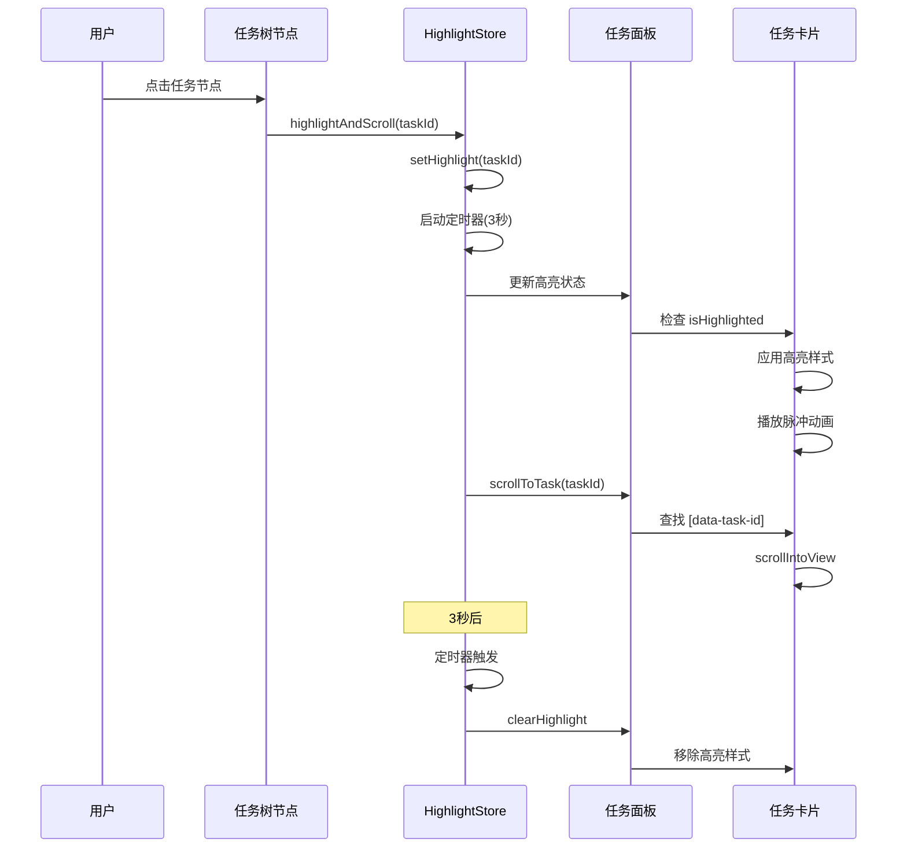

# 任务导航树高亮功能实现指南

## 概述

本功能实现了任务导航树与任务面板之间的交互：当在导航树中点击任务时，任务面板中对应的任务会自动高亮并滚动到视图中心。

---

## 核心实现

### 1. 状态管理 (taskHighlight.ts)

使用 Pinia 管理高亮状态：

```typescript
import { useTaskHighlightStore } from '../stores/taskHighlight'

const taskHighlight = useTaskHighlightStore()

// 设置高亮
taskHighlight.setHighlight('task-123', 3000) // 高亮3秒

// 高亮并滚动
taskHighlight.highlightAndScroll('task-123', 3000)

// 清除高亮
taskHighlight.clearHighlight()

// 检查是否高亮
if (taskHighlight.isHighlighted('task-123')) {
  console.log('任务已高亮')
}
```

### 2. 任务卡片高亮组件 (HighlightableTaskCard.vue)

**关键特性**：
- 使用 `data-task-id` 属性标识任务
- 自动应用高亮样式
- 支持悬停效果
- 脉冲动画效果

**使用方式**：

```vue
<template>
  <HighlightableTaskCard :task="task">
    <!-- 任务内容 -->
    <div class="task-content">
      {{ task.title }}
    </div>
  </HighlightableTaskCard>
</template>
```

### 3. 任务树节点组件 (TaskTreeItem.vue)

**关键特性**：
- 点击时触发高亮和滚动
- 支持嵌套子任务
- 展开/折叠功能
- 显示任务状态图标

**使用方式**：

```vue
<template>
  <TaskTreeItem
    v-for="task in tasks"
    :key="task.id"
    :task="task"
    @task-click="handleTaskClick"
  />
</template>
```

---

## 工作原理

### 交互流程



### 关键技术点

#### 1. 使用 data-task-id 定位任务

```vue
<!-- 任务卡片 -->
<div data-task-id="task-123" class="task-card">
  <!-- 内容 -->
</div>
```

```typescript
// 滚动到任务
function scrollToTask(taskId: string) {
  const element = document.querySelector(`[data-task-id="${taskId}"]`)
  if (element) {
    element.scrollIntoView({
      behavior: 'smooth',
      block: 'center'
    })
  }
}
```

#### 2. 响应式高亮状态

```typescript
// 在组件中检查高亮状态
const isHighlighted = computed(() => 
  taskHighlight.isHighlighted(props.task.id)
)
```

#### 3. 自动清除定时器

```typescript
// 设置高亮时启动定时器
function setHighlight(taskId: string, duration: number) {
  highlightedTaskId.value = taskId
  
  // 自动清除
  setTimeout(() => {
    clearHighlight()
  }, duration)
}
```

---

## 样式效果

### 高亮动画

```css
@keyframes highlight-pulse {
  0% {
    box-shadow: 0 0 0 0 rgba(33, 150, 243, 0.8);
    background: rgba(33, 150, 243, 0.1);
  }
  50% {
    box-shadow: 0 0 0 8px rgba(33, 150, 243, 0.2);
    background: rgba(33, 150, 243, 0.08);
  }
  100% {
    box-shadow: 0 0 0 0 rgba(33, 150, 243, 0);
    background: rgba(33, 150, 243, 0.05);
  }
}
```

### 视觉效果

| 状态 | 效果 | 持续时间 |
|------|------|---------|
| 默认 | 无特殊效果 | - |
| 悬停 | 上移 + 阴影增强 | 立即 |
| 高亮 | 蓝色光晕 + 脉冲动画 | 3秒 |
| 激活 | 背景色变化 | 持续 |

---

## 完整示例

### 集成到现有项目

#### 1. 在任务面板中使用

```vue
<template>
  <div class="task-panel">
    <HighlightableTaskCard
      v-for="task in tasks"
      :key="task.id"
      :task="task"
    >
      <!-- 原有的任务卡片内容 -->
      <TaskCard :task="task" />
    </HighlightableTaskCard>
  </div>
</template>
```

#### 2. 在任务树中使用

```vue
<template>
  <div class="task-tree">
    <TaskTreeItem
      v-for="task in tasks"
      :key="task.id"
      :task="task"
      @task-click="handleTaskClick"
    />
  </div>
</template>

<script setup>
function handleTaskClick(task) {
  console.log('任务被点击:', task.id)
  // 可以在这里添加额外的处理逻辑
}
</script>
```

---

## API 参考

### taskHighlightStore

#### State

| 属性 | 类型 | 说明 |
|------|------|------|
| `highlightedTaskId` | `string \| null` | 当前高亮的任务ID |
| `hasHighlight` | `boolean` | 是否有高亮任务 |

#### Methods

| 方法 | 参数 | 返回值 | 说明 |
|------|------|--------|------|
| `setHighlight` | `taskId: string, duration?: number` | `void` | 设置高亮 |
| `clearHighlight` | - | `void` | 清除高亮 |
| `isHighlighted` | `taskId: string` | `boolean` | 检查是否高亮 |
| `scrollToTask` | `taskId: string` | `void` | 滚动到任务 |
| `highlightAndScroll` | `taskId: string, duration?: number` | `void` | 高亮并滚动 |

---

## 最佳实践

### 1. 确保任务ID唯一

```typescript
// ✅ 推荐：使用唯一ID
const task = {
  id: 'task-' + Date.now() + '-' + Math.random(),
  title: '新任务'
}

// ❌ 不推荐：使用索引
const task = {
  id: 'task-' + index,
  title: '新任务'
}
```

### 2. 合理设置高亮持续时间

```typescript
// 快速浏览：2秒
taskHighlight.highlightAndScroll(taskId, 2000)

// 详细查看：5秒
taskHighlight.highlightAndScroll(taskId, 5000)

// 持续高亮：手动控制
taskHighlight.setHighlight(taskId, 0) // 0表示不自动清除
// ... 用户操作后
taskHighlight.clearHighlight()
```

### 3. 处理大量任务

```typescript
// 使用虚拟滚动时，确保任务元素存在
async function highlightTask(taskId: string) {
  // 先加载任务（如果使用虚拟滚动）
  await ensureTaskLoaded(taskId)
  
  // 等待DOM更新
  await nextTick()
  
  // 高亮并滚动
  taskHighlight.highlightAndScroll(taskId)
}
```

---

## 故障排除

### 问题1: 点击后任务没有高亮

**原因**: 任务卡片没有使用 `HighlightableTaskCard` 组件

**解决**:
```vue
<!-- ❌ 错误 -->
<div class="task-card">
  {{ task.title }}
</div>

<!-- ✅ 正确 -->
<HighlightableTaskCard :task="task">
  <div class="task-card">
    {{ task.title }}
  </div>
</HighlightableTaskCard>
```

### 问题2: 滚动不生效

**原因**: 任务元素没有 `data-task-id` 属性

**解决**:
```vue
<!-- ❌ 错误 -->
<div class="task-card">
  {{ task.title }}
</div>

<!-- ✅ 正确 -->
<div :data-task-id="task.id" class="task-card">
  {{ task.title }}
</div>
```

### 问题3: 高亮不消失

**原因**: 定时器没有正确设置

**解决**:
```typescript
// 确保设置了持续时间
taskHighlight.setHighlight(taskId, 3000) // 3秒后自动清除

// 或手动清除
taskHighlight.clearHighlight()
```

---

## 扩展功能

### 1. 批量高亮

```typescript
// 扩展 store
function highlightMultiple(taskIds: string[], delay = 500) {
  taskIds.forEach((id, index) => {
    setTimeout(() => {
      setHighlight(id, delay)
    }, index * delay)
  })
}
```

### 2. 高亮历史

```typescript
// 扩展 store
const highlightHistory = ref<string[]>([])

function setHighlight(taskId: string, duration?: number) {
  highlightedTaskId.value = taskId
  
  // 记录历史
  highlightHistory.value.unshift(taskId)
  if (highlightHistory.value.length > 10) {
    highlightHistory.value.pop()
  }
}
```

### 3. 高亮路径

```typescript
// 高亮任务及其所有父任务
function highlightTaskPath(task: Task) {
  const path = getTaskPath(task) // 获取任务路径
  
  path.forEach((taskId, index) => {
    setTimeout(() => {
      setHighlight(taskId, 1000)
    }, index * 200)
  })
}
```

---

## 相关资源

- [Pinia 文档](https://pinia.vuejs.org/)
- [Vue 3 Composition API](https://vuejs.org/api/composition-api.html)
- [scrollIntoView API](https://developer.mozilla.org/en-US/docs/Web/API/Element/scrollIntoView)
