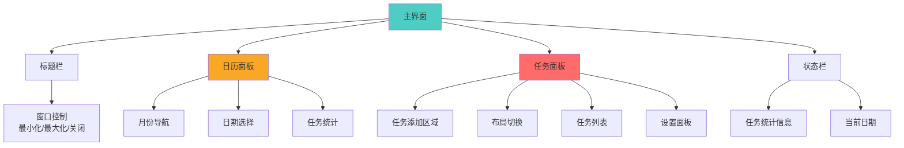
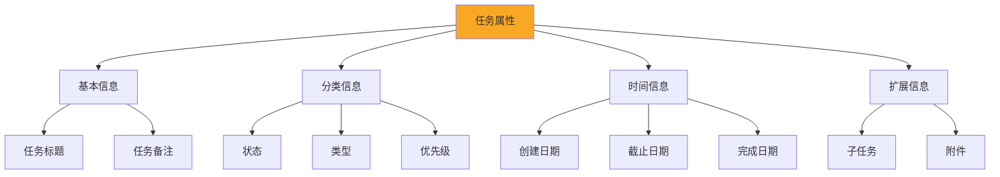
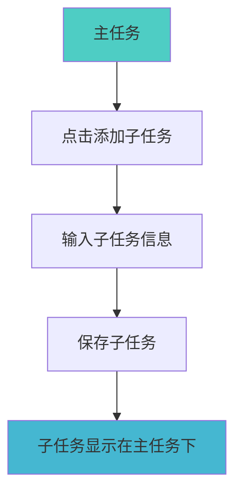
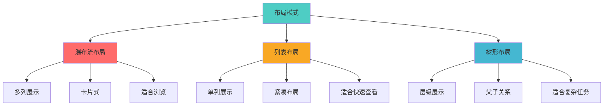
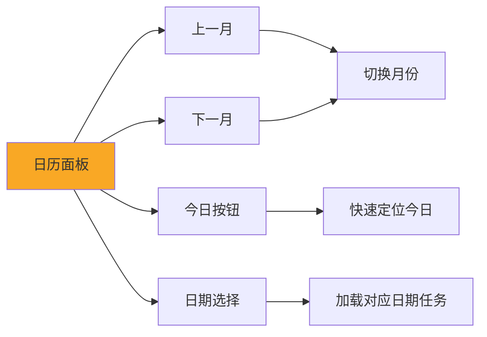
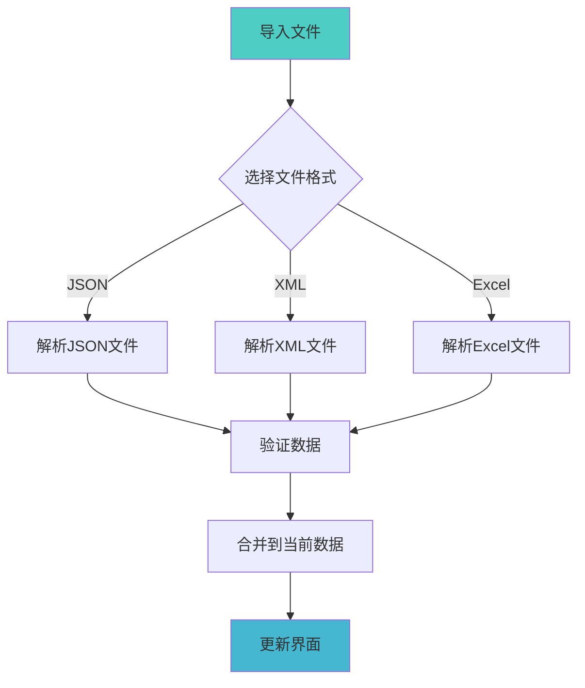
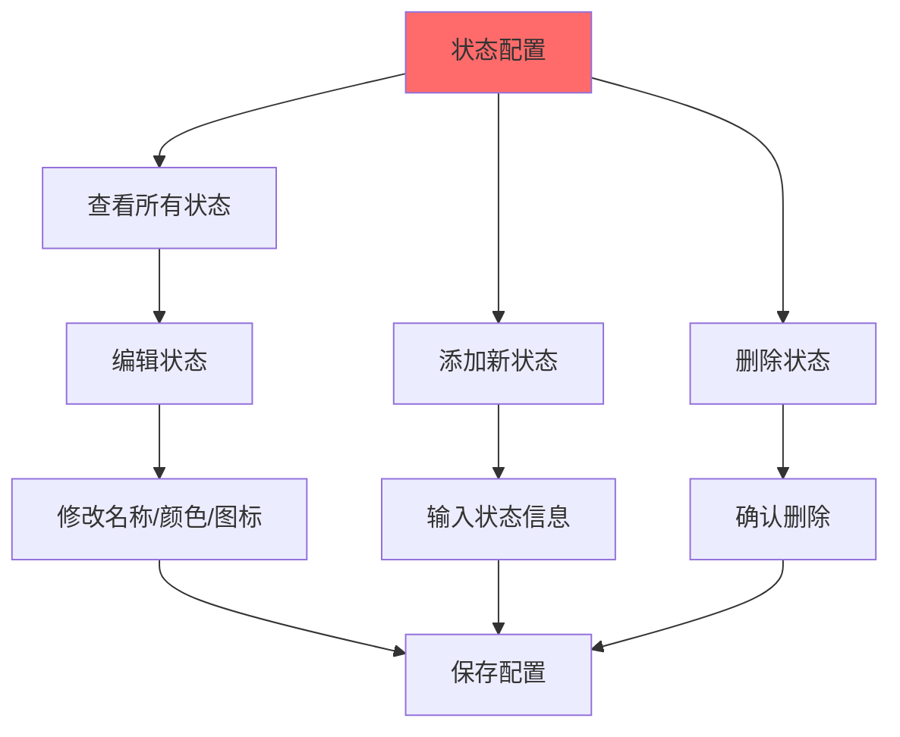
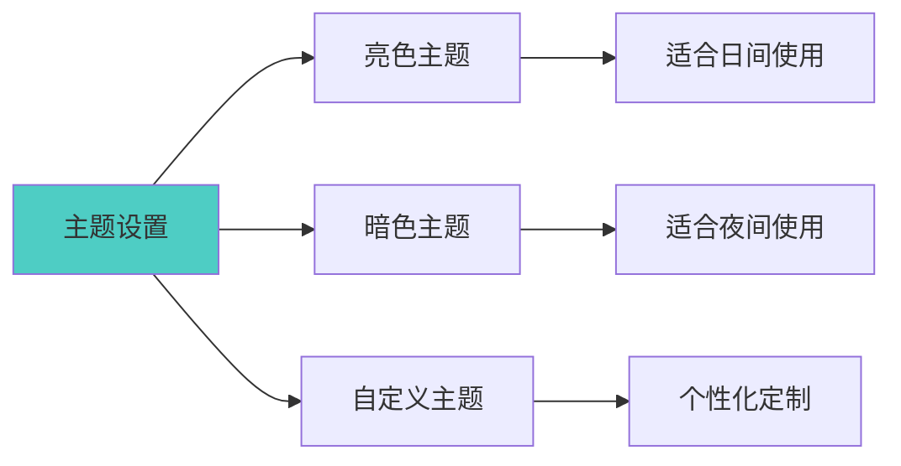
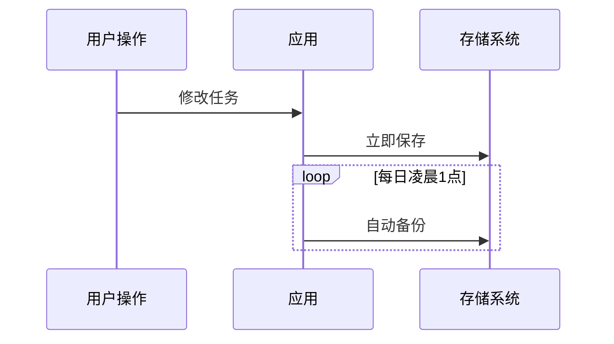
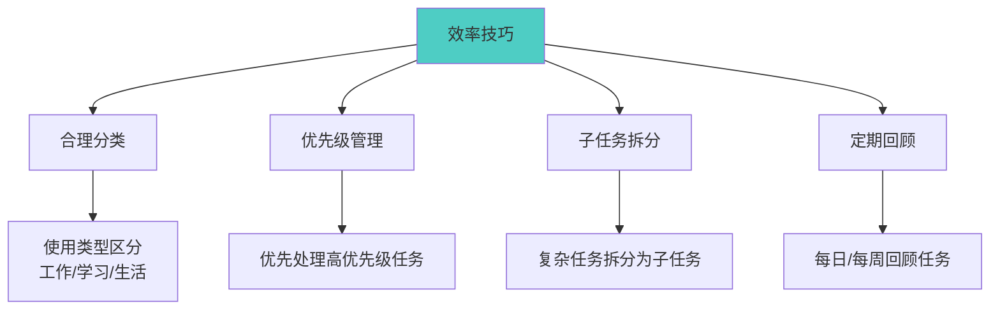

# 灵境待办 - 用户手册

## 欢迎使用灵境待办

**灵境待办** 是一款现代化的跨平台桌面任务管理应用，帮助您高效管理日常任务、规划时间、提升工作效率。

---

## 快速开始

### 安装应用

#### Windows
1. 下载 `lingjingtodo_x.x.x_x64.msi` 安装包
2. 双击安装包，按照向导完成安装
3. 启动应用

#### macOS
1. 下载 `lingjingtodo_x.x.x_x64.dmg` 安装包
2. 打开 DMG 文件，拖拽应用到 Applications 文件夹
3. 启动应用

#### Linux
1. 下载 `lingjingtodo_x.x.x_amd64.deb` 安装包
2. 运行 `sudo dpkg -i lingjingtodo_x.x.x_amd64.deb`
3. 启动应用

---

## 界面概览

### 主界面布局

### 界面元素说明

| 区域 | 功能 |
|------|------|
| 标题栏 | 窗口控制、应用标题 |
| 日历面板 | 日期选择、月份导航、任务统计 |
| 任务面板 | 任务管理、布局切换、设置 |
| 状态栏 | 显示统计信息、当前日期 |

---

## 基本操作

### 创建任务

**步骤**:
1. 在任务面板顶部找到任务添加区域
2. 输入任务标题（必填）
3. 选择任务状态（待规划/已启动/进行中/等）
4. 选择任务类型（工作/学习/生活）
5. 选择优先级（P0-致命 ~ 不紧急）
6. 按 `Enter` 键或点击添加按钮

### 编辑任务

**方式一：快速编辑**
- 点击任务标题，直接修改

**方式二：详细编辑**
- 点击任务卡片上的编辑按钮
- 在弹出的对话框中修改详细信息

### 删除任务

1. 点击任务卡片上的删除按钮
2. 确认删除操作
3. 任务将被永久删除

### 完成任务

1. 点击任务状态标签
2. 选择"已完成"状态
3. 系统自动记录完成时间

---

## 任务管理

### 任务属性

### 状态说明

| 状态 | 图标 | 说明 |
|------|------|------|
| 待规划 | 📋 | 任务已创建，待规划执行 |
| 已启动 | 🚀 | 任务已启动，准备执行 |
| 进行中 | 🔄 | 任务正在执行中 |
| 已完成 | ✅ | 任务已完成 |
| 已延期 | ⏰ | 任务已延期 |
| 已关闭 | 📦 | 任务已关闭 |

### 优先级说明

| 优先级 | 图标 | 说明 |
|--------|------|------|
| P0-致命 | 🔥 | 最高优先级，必须立即处理 |
| P1-紧急 | ⚡ | 紧急任务，优先处理 |
| P2-高 | 🔴 | 高优先级任务 |
| P3-中 | 🟡 | 中等优先级任务 |
| P4-低 | 🟢 | 低优先级任务 |
| P5-N | ⚪ | 普通任务 |
| 不紧急 | 🔵 | 不紧急任务 |

---

## 子任务管理

### 添加子任务

**步骤**:
1. 点击主任务卡片上的"添加子任务"按钮
2. 输入子任务标题
3. 设置子任务属性（状态、类型、优先级）
4. 保存子任务

### 管理子任务

- **编辑**: 点击子任务进行编辑
- **删除**: 点击子任务的删除按钮
- **完成**: 更改子任务状态为"已完成"

---

## 视图布局

### 三种布局模式

### 切换布局

1. 在任务面板顶部找到布局切换按钮
2. 选择想要的布局模式：
   - **瀑布流**: 多列卡片展示
   - **列表**: 单列紧凑展示
   - **树形**: 层级结构展示

### 拖拽排序

- 在瀑布流和列表布局中，可以拖拽任务卡片进行排序
- 拖拽后自动保存新的排序

---

## 日历功能

### 日期导航

**操作**:
- 点击 `<` 按钮查看上一月
- 点击 `>` 按钮查看下一月
- 点击"今日"按钮快速定位到今天
- 点击具体日期查看该日任务

### 任务统计

日历面板显示每日任务统计：
- 数字表示该日任务总数
- 不同颜色表示不同状态

---

## 文件操作

### 导入数据

**步骤**:
1. 点击"导入"按钮
2. 选择要导入的文件（支持 JSON/XML/Excel）
3. 确认导入
4. 数据将合并到当前任务列表

### 导出数据

**步骤**:
1. 点击"导出"按钮
2. 选择导出格式（JSON/XML/Excel）
3. 选择保存位置
4. 确认导出

### 历史文件

- 应用自动记录最近打开的文件
- 在欢迎界面可以快速访问历史文件
- 点击历史文件快速加载

---

## 配置管理

### 状态配置

**操作**:
1. 打开设置面板
2. 点击"状态管理"
3. 添加、编辑或删除状态
4. 保存配置

### 类型配置

**预设类型**:
- 💼 工作
- 📚 学习
- 🏠 生活

**自定义类型**:
1. 打开设置面板
2. 点击"类型管理"
3. 添加新类型或编辑现有类型

### 优先级配置

**预设优先级**:
- 🔥 P0-致命
- ⚡ P1-紧急
- 🔴 P2-高
- 🟡 P3-中
- 🟢 P4-低
- ⚪ P5-N
- 🔵 不紧急

---

## 主题设置

### 切换主题

**操作**:
1. 打开设置面板
2. 点击"主题管理"
3. 选择预设主题或自定义主题

---

## 快捷键

### 全局快捷键

| 快捷键 | 功能 |
|--------|------|
| `Ctrl/Cmd + N` | 新建任务 |
| `Ctrl/Cmd + S` | 保存数据 |
| `Ctrl/Cmd + O` | 打开文件 |
| `Ctrl/Cmd + E` | 导出数据 |
| `Esc` | 关闭对话框 |

### 编辑快捷键

| 快捷键 | 功能 |
|--------|------|
| `Enter` | 确认输入 |
| `Esc` | 取消编辑 |
| `Tab` | 切换输入框 |

---

## 数据安全

### 自动保存

**自动保存机制**:
- 每次修改后立即保存
- 每日凌晨1点自动备份
- 数据存储在本地，安全可靠

### 数据备份

**建议**:
- 定期导出数据备份
- 使用多种格式备份（JSON + Excel）
- 保存备份到云盘或外部存储

---

## 常见问题

### Q1: 如何恢复误删的任务？

**A**: 目前不支持回收站功能，建议：
- 定期备份数据
- 导出数据前确认操作

### Q2: 数据存储在哪里？

**A**: 数据存储在应用数据目录：
- Windows: `C:\Users\用户名\AppData\Local\lingjingtodo\`
- macOS: `~/Library/Application Support/lingjingtodo/`
- Linux: `~/.local/share/lingjingtodo/`

### Q3: 如何迁移数据到新电脑？

**A**: 
1. 在旧电脑导出所有数据
2. 在新电脑安装应用
3. 导入数据文件

### Q4: 支持哪些文件格式？

**A**: 支持三种格式：
- JSON: 适合数据交换
- XML: 适合系统集成
- Excel: 适合数据分析和报表

### Q5: 如何自定义状态/类型/优先级？

**A**: 
1. 打开设置面板
2. 选择对应的配置管理
3. 添加、编辑或删除配置项

---

## 使用技巧

### 提升效率的技巧

### 最佳实践

1. **每日规划**: 每天早上规划当日任务
2. **优先级排序**: 先处理高优先级任务
3. **任务拆分**: 复杂任务拆分为可执行的子任务
4. **及时更新**: 完成任务后及时更新状态
5. **定期回顾**: 每周回顾任务完成情况

---

## 更新日志

### v0.1.0 (当前版本)

**新功能**:
- ✅ 基础任务管理功能
- ✅ 三种布局模式
- ✅ 子任务管理
- ✅ 多格式导入导出
- ✅ 自动保存机制
- ✅ 自定义配置

**已知问题**:
- 大量任务时性能待优化
- 暂不支持回收站功能

---

## 技术支持

### 获取帮助

- **项目主页**: https://github.com/hemy08/LingJingToDo
- **问题反馈**: GitHub Issues
- **功能建议**: GitHub Discussions

### 反馈问题

提交问题时请包含：
1. 操作系统版本
2. 应用版本
3. 问题描述
4. 复现步骤
5. 截图（如有）

---

## 许可证

本项目采用 MIT 许可证，详见 LICENSE 文件。

---

感谢使用灵境待办！祝您工作顺利，效率倍增！🎯
